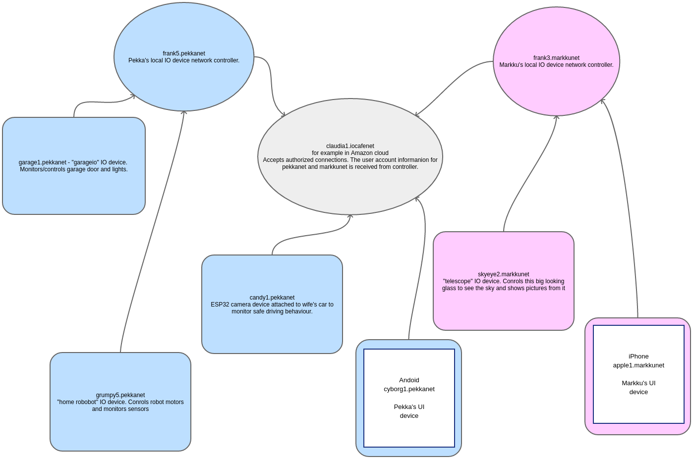

IOCOM secure network topology
================================
This is IoT related. If your goal is simply to connect IO devices to a computer within a local net or using 
serial communication, skip this topic. 

The network topology is an application-level feature supported by IOCOM. The ioserver extension library
can be used as is, or as a starting point to provice user accounts, etc.

The network topology of distributed system is closely related to security: 

* Connections to be encrypted. This is the easy part since TLS provides a standard solution.
* Identify each device. A device is identified by user name and password, or by server certificate.
* We need to keep IO device networks of separate people strictly apart. Even we would use the same cloud server 
  to access data from two IO device networks, data can not be passed from one device network to another. 

   Cloud server can provide access to multiple IO device networks.

* An Pekka's devices connect upwards to Pekka's IO device network controller. Either staight or trough an 
  intermediate, like the cloud server. Similarly Markku's devices connect to his IO device network controller.
* Arrows in connection mark direction of TCP/IP socket connection, from client to server. Direction is 
  important for security/authentication. 
* One can think of IO device or controller as a process which runs in some computer or micro-controller.
* We make ready basic controller application which allows sharing IOCOM data within device network. 
  If one wants to generate, let’s say HTML, by information in the cloud server, the IO domain controller must
  be programmed to do such a thing. 
* On local net, it is possible to run this topology also without security over regular socket instead of TLS.
  Less secure, but makes setting it up a bit easier.

190919, updated 22.5.2020/pekka
