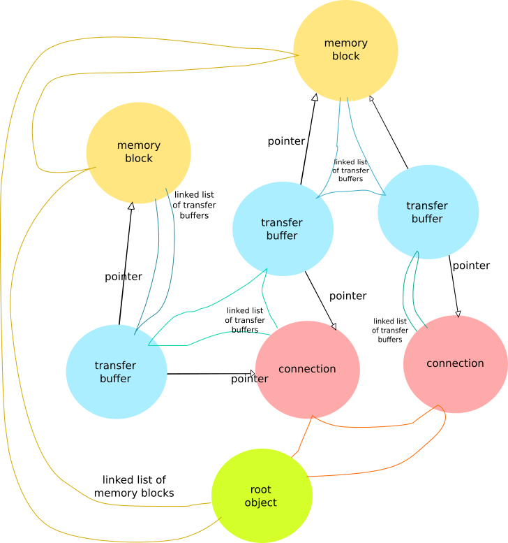

Object interconnections
=========================

Linked lists are used to bind communication objects together to form communication hierarchy. 

   object interconnections

The root maintains list of initialized memory blocks  and list of initialized connections. Similarly list of attached transfer buffers is maintained for connections and memory blocks. Object is detached from object hierarchy and all linked lists by calling remove function (like ioc_remove_memory_block()). Transfer buffer structure holds pointers to both memory block and connection it is attached to. In addition (not shown in picture) that every communication object holds pointer to root object.

200114, updated 22.5.2020/pekka
