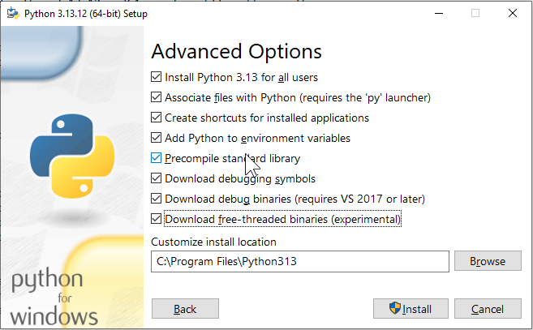
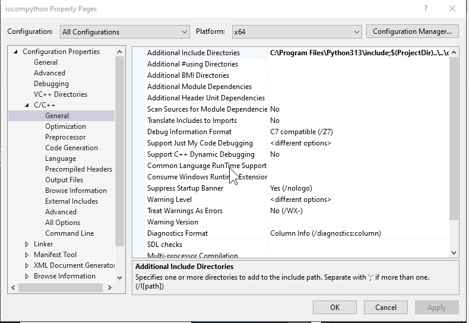
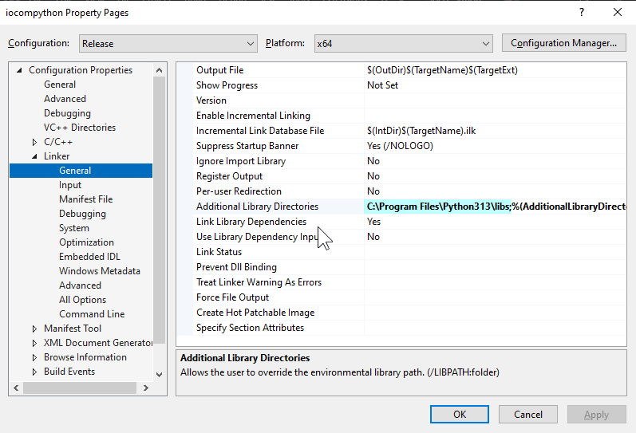

Installing Python for Windows development
===================================================================

Download installer for latest stable 64 bit AMD Python version from https://www.python.org.
(python-3.13.12-amd64.exe at time of writing these notes).

Install Python
Microsoft Visual Studio with C/C++ development tools should propably be installed before
installing Python.

Check "Add python.exe to PATH" and "Use admin priviliges when installing py.exe"
Select Customize installation, make sure that every box is checked.

   
   Select everything in advance options

You may need to modify python include and library paths to match installed python version number.

   Python include path points to headers within installed Python version.

   Python library path points to libraries within installed Python version.

To set the PYTHONPATH environment variable on Windows, you 
- go to the Start menu search for "Environment Variables," 
  and then add a new variable named PYTHONPATH with the desired 
  directory path as its value. Alternatively, you can set it using 
 Command Prompt with the command set PYTHONPATH=c:\path\to\my\modules for a temporary change.

Test with asteroidasteroid C:\coderoot\iocom\extensions\iocompython\examples\asteroid-service
and C:\coderoot\iocom\extensions\iocompython\examples\asteroid-client-pyglet

260228, last updated 27.2.2026/pekka
