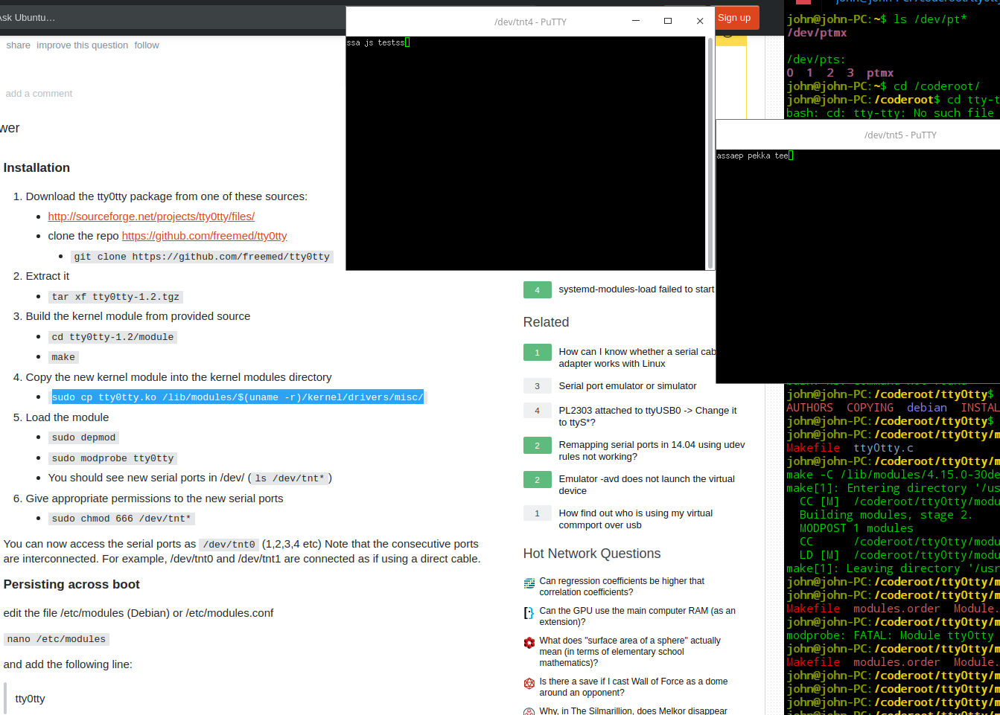

Serial port emulation with tty0tty
==========================================
The tty0tty package compiles to kernel module which created pairs of serial port devices /dev/tnt* connected together. 

Get the code
************
Download the tty0tty package from one of these sources:

* http://sourceforge.net/projects/tty0tty/files/
* clone the repo https://github.com/freemed/tty0tty
* git clone https://github.com/freemed/tty0tty

Extract it
**********

.. code-block:: shell

   tar xf tty0tty-1.2.tgz

Build
*****
Build the kernel module from provided source

.. code-block:: shell

  cd tty0tty-1.2/module
  make

Install new kernel module
*************************
Copy the new kernel module into the kernel modules directory

.. code-block:: shell

   sudo cp tty0tty.ko /lib/modules/$(uname -r)/kernel/drivers/misc/

Load the module
***************

.. code-block:: shell
  
   sudo depmod
   sudo modprobe tty0tty

You should see new serial ports in /dev/ (ls /dev/tnt*)

Set permissions
***************
Give appropriate permissions to the new serial ports

.. code-block:: shell

    sudo chmod 666 /dev/tnt*

You can now access the serial ports as /dev/tnt0 (1,2,3,4 etc) Note that the consecutive 
ports are connected to each others. For example, /dev/tnt0 and /dev/tnt1 are connected as if using a direct cable.

Persisting across boot
**********************
edit the file /etc/modules (Debian) or /etc/modules.conf

.. code-block:: shell

    nano /etc/modules

and add line "tty0tty" the to it:

200427, updated 20.5.2020/pekka

