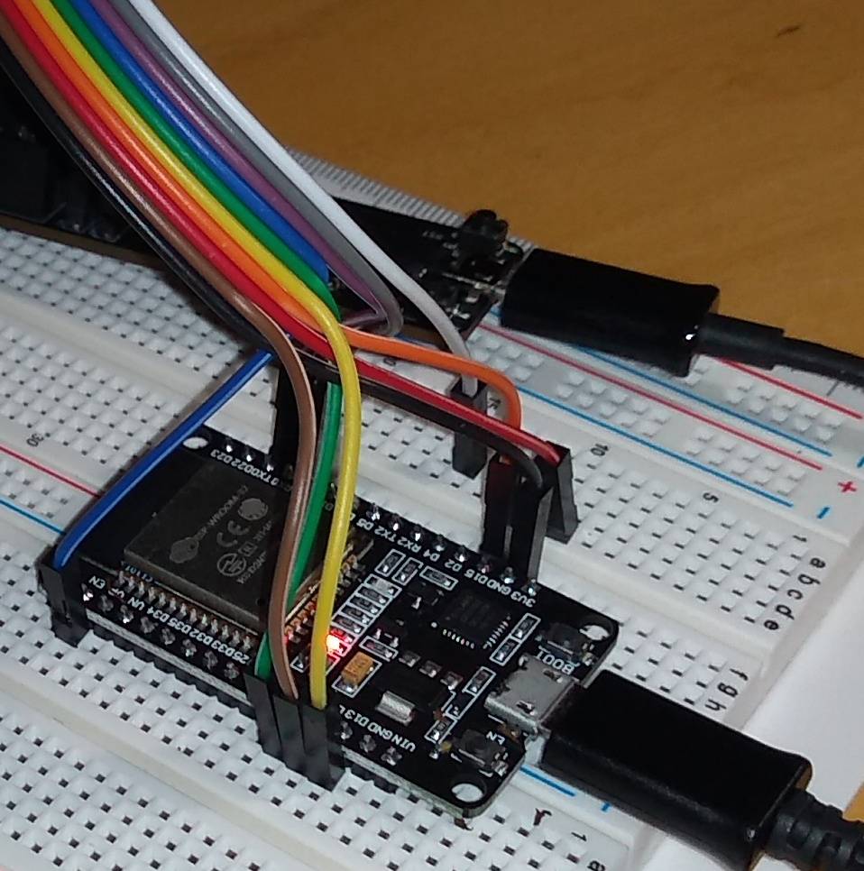
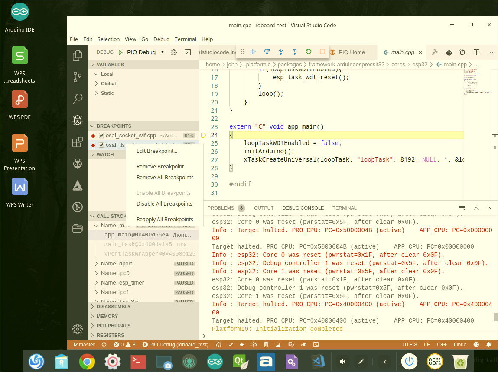

Debugging ESP32 with Platform IO + Visual Studio Code, and Esp-Prog/JTAG
=========================================================================

Hardware
***********************
The micro-controller development board: MELIFE ESP32 Development Board (from Amazon).
External USB/JTAG debugger: ESP-Prog (from Grid Connect).

   ESP32 development board and ESP-Prog on background

It is a bit of effort to find correct pins to connect. Initially, I powered the ESP32 trough Esp-Prog. 
This didn’t provide enough current, causing “brownouts” at ESP when Wifi started up. 

ESP-idf – the ESP32 support and development
********************************************
The first thing needed to develop for ESP32 is esp-idf by Espressif, the chip maker. It is solid and good,
and can be used to build, load and monitor ESP32 code as it. But it is not a full-fledged development 
environment with a debugger, other components are needed. If one wants a GUI, choices are Eclipse or Visual
Studio code. I vote for Visual Studio Code, even it is tricky to set up it is still easier than Eclipse
and works with Platform IO

Arduino libraries – nice to use and pain to debug
**************************************************
I find Arduino API “about portable” from micro-controller to another. Way of distributing libraries as 
.zip files containing sources is also good, and the best part is that the application stays small,
simple and readable. Hardware dependent code is not bundled in.
It is an environment which has not given any taught on debugging, which is painful to put it nicely. 
Options that have worked for me are using gdb -tui from the command line (hackaday) or using Visual
Studio Code + Platform IO + GDB. Both have their own tricks and are not easy to set up or use, 
but get the job done. As a preference I think Visual Studio Code works ok, still it is easy to
make mistakes with multiple copies of library source code.

   Visual Studio Code/Platform IO/GDB debugging in Deepin virtual machine

200314, updated 15.5.2020/pekka
