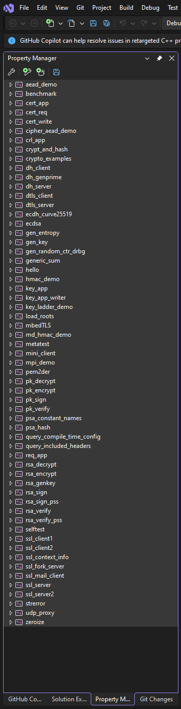
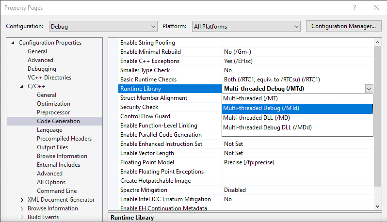
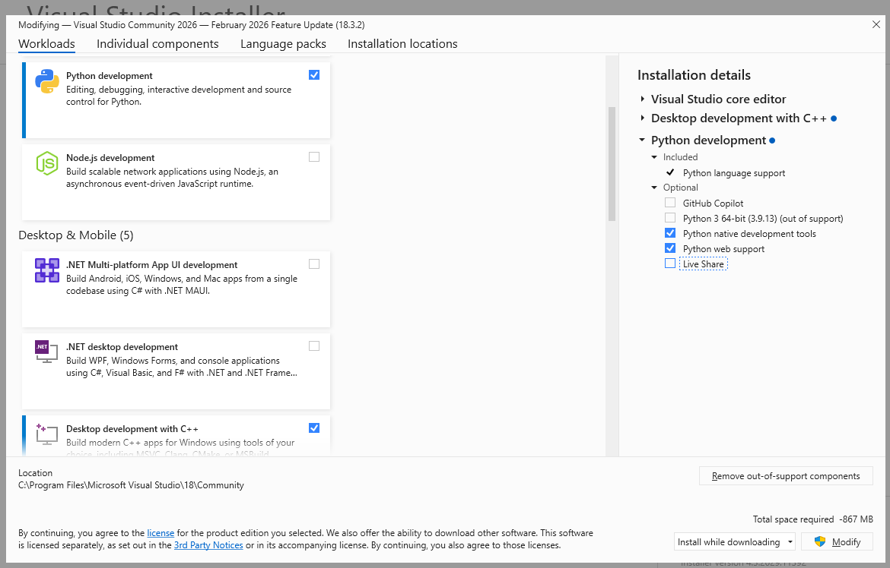

Visual Studio Code - Linux/Windows desktop C/C++ build notes
=========================================================================

When building mbedtls, etc, from sources, select /MT or /MTd
***********************

Build statically linked libraries for linking with eosal, etc. 

   Select all projects

   Select all projects

Python is needed for Visual Studio development.

Renaming build folder
********************************************

   Select python when installing Visual Studio

260311, updated 11.3.2026/pekka

