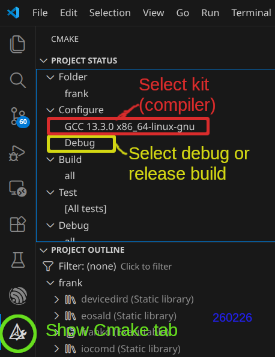
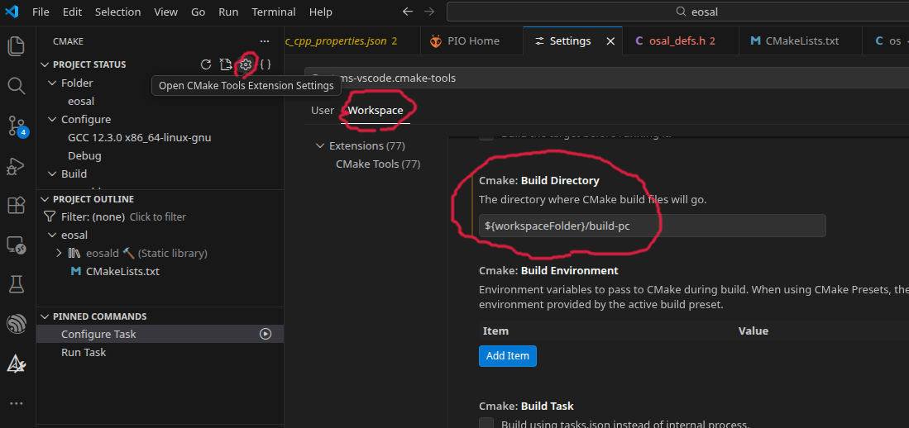

Visual Studio Code - Linux/Windows desktop C/C++ build notes
=========================================================================

Visual Studio Code extension "C/C++ IntelliSense, debugging, and code browsing".

Switching between debug and release builds
***********************

The micro-controller development board: MELIFE ESP32 Development Board (from Amazon).
External USB/JTAG debugger: ESP-Prog (from Grid Connect).

   Where to switch between debug and release build

Renaming build folder
********************************************
If you do ESP32 ESP-IDF and PCbuilds with Visual Studio Code on the same computer, it is useful
to rename the build folder used for Linux/Windows PC builds. Then the ESP32 and PC builds 
do not get mixed up in conflict. Renaming ESP32 build folder is not possible, because ESP-IDF 
build system needs to have the build folder named "build". But for PC builds, it is possible 
to use any name for the build folder. I renamed it to "build_pc" in my Visual Studio Code workspace. 

   Where to rename Linux/Windows PCbuild folder. 

260311, updated 11.3.2026/pekka
