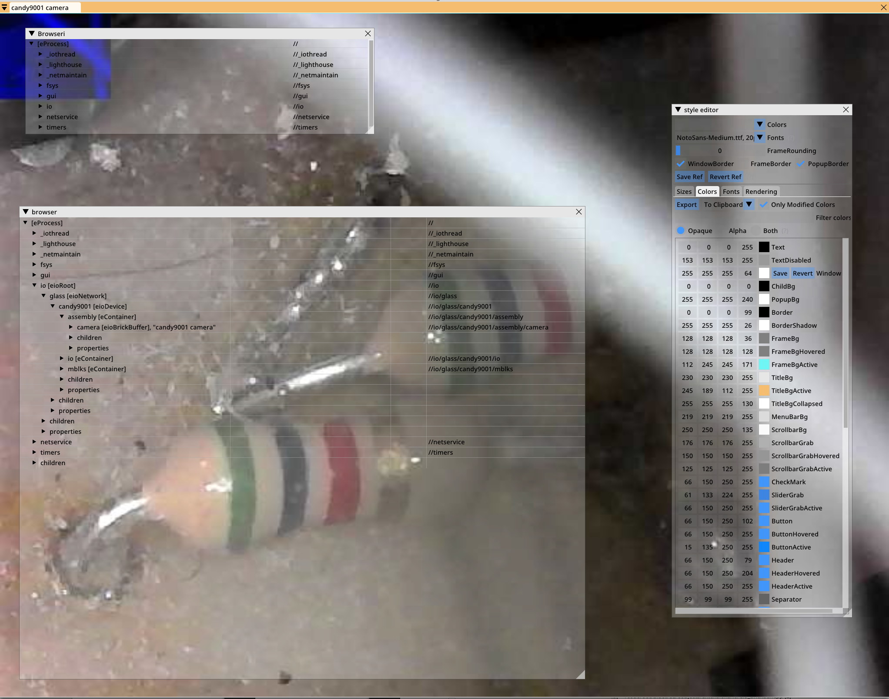

"Glass"
==================================

Glass views eobjects tree, and can open windows which visualize these objects. Much of how an object is viewed is is based on data it contains, and metadata within object. 

The egui works trough high level "ecom" connections, which map processes (in different computers) as one eobjects tree. It also integrates with low level "iocom" protocol, IO device network communication.

The egui look and feel, and and application user interface structure is intended to be customizable. Idea is to  allow it to adopt to applications requiremenets, device on which it runs (pc/tablet/phone) and to fashion trends in UI makeup.

   "Early glass prototyping".

.. toctree::
   :maxdepth: 2
   :caption: Contents:

   210215-glass-introduction

