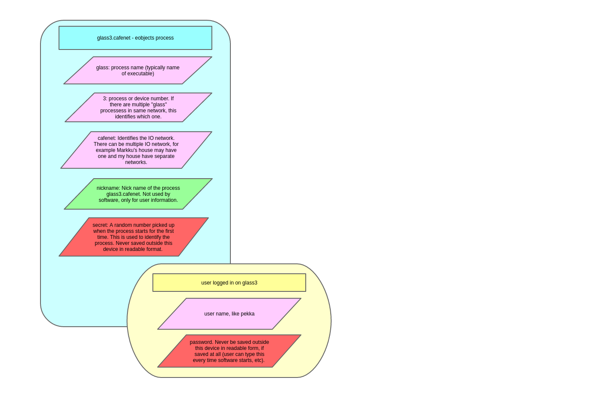

Process and user identification
================================

To have security and authentication, we need to identify processes (~ IO devices) and optionally user who has logged on.
On top level, we have multiple IO networks, like my home network and Markku's home network, which need to be kept separate.

   Process and user identification

Network name - which IO network this process belongs to, here "cafenet". 
Process ID - Process name and number together make process IO, like "glass3", or "glass3.cafenet" in larget scope.
User name - Identifies used logged on to the UI process.

updated 27.2.2021/pekka
