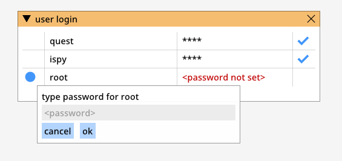

User login in UI application
==================================

User login and password are simply global variables, only one user can be logged in at a time. 
The access rights to /coderoot/fsys/data/glass0/_secret/_login.ec, etc, login data file need
to be restricted only to the user interface account. The _login.ec file is AES encrypted and bound
to current computer only, but this is only for additional security: Primary focus should be on
operating system provided security.

   "User login dialog".

.. toctree::
   :maxdepth: 2
   :caption: Contents:

210215, updated 16.2.2021/pekka
