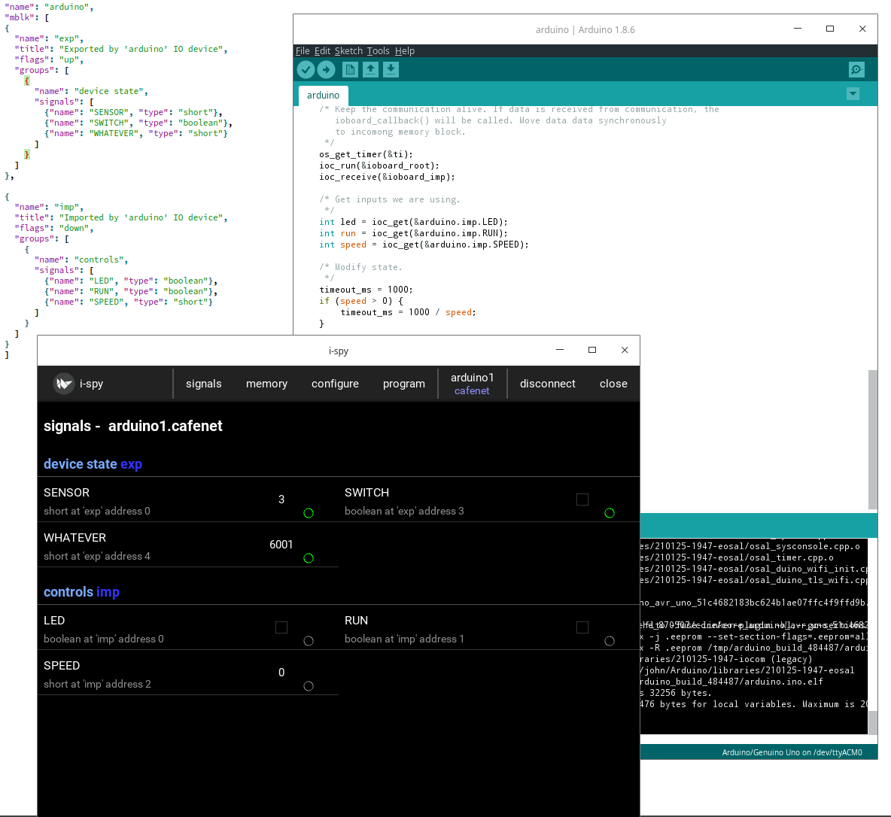

Arduino - IOCOM example in "Arduino style"
=============================================================
The "arduino" is used to test and demonstrate using IOCOM library as library from typical Arduino application.

This example uses iocom/eosal entry point and loop functions, so that same code builds on linux.
Normal Arduino ones could be used as well. This may be more readable option, since common Arduino
framework is more clearly visible and calls to iocom like any library calls. 

IOCOM is built with OSAL_MINIMALISTIC flag, which leaves only bare 
bones serial communication. This should be set automatically when building for UNO. 

Code tree
**************
The example code should look as below. Important files are arduino.ino, signals.json and config_to_c_code.py
script. Files in config/intermediate are temporary build files and in config/include C code generated
from signals.json file. 

::

    (base) john@iocafe:/coderoot/iocom/examples/arduino$ tree
    .
    ├── arduino.ino
    ├── config
    │   ├── include
    │   │   └── generic
    │   │       ├── json_io_config.c
    │   │       ├── json_io_config.h
    │   │       ├── signals.c
    │   │       ├── signals.h
    │   │       ├── signals_info_mblk.c
    │   │       └── signals_info_mblk.h
    │   ├── intermediate
    │   │   └── generic
    │   │       ├── signals-merged.binjson
    │   │       ├── signals-merged-check.json
    │   │       └── signals-merged.json
    │   └── signals
    │       └── signals.json
    └── scripts
        └── config_to_c_code.py

IOCOM signal configuration
***************************
The config/signals.json defines how this IO device looks like trough communication.
This JSON is converted to C code by scripts, and the generated C code is included
in the Arduino program. 

::

    {
    "name": "arduino",
    "mblk": [
    {
        "name": "exp",
        "title": "Exported by 'arduino' IO device",
        "flags": "up",
        "groups": [
        {
            "name": "device state",
            "signals": [
            {"name": "SENSOR", "type": "short"},
            {"name": "SWITCH", "type": "boolean"},
            {"name": "WHATEVER", "type": "boolean"}
            ]
        }
        ]
    },

    {
        "name": "imp",
        "title": "Imported by 'arduino' IO device",
        "flags": "down",
        "groups": [
        {
            "name": "controls",
            "signals": [
            {"name": "LED", "type": "boolean"},
            {"name": "RUN", "type": "boolean"},
            {"name": "SPEED", "type": "short"}
            ]
        }
        ]
    }
    ]
    }

* Use json linter https://jsonlint.com/ to verify that signals.json syntax is valid. If not, build will fail and it may be hard to see where the problem is.
* Run scripts/config_to_c_code.py to covert JSON signal configuration to C code in config/include folder.

The C code 
***********************
The arduino.ino is the actual code example. 

::

    #define IOCOM_IOBOARD
    #define IOBOARD_CTRL_CON IOBOARD_CTRL_CONNECT_SERIAL
    #include "iocomx.h"
    #include "config/include/generic/signals.h"
    #include "config/include/generic/signals_info_mblk.h"

    /* Include signal configuration C code.
    */
    #include "config/include/generic/signals.c"
    #include "config/include/generic/signals_info_mblk.c"

    /* Maximum number of sockets, etc.
    */
    #define IOBOARD_MAX_CONNECTIONS 1

    /* Use static memory pool. 
    */
    static os_char
        ioboard_pool[IOBOARD_POOL_SIZE(IOBOARD_CTRL_CON, IOBOARD_MAX_CONNECTIONS,
            ARDUINO_EXP_MBLK_SZ, ARDUINO_IMP_MBLK_SZ)
            + IOBOARD_POOL_DEVICE_INFO(IOBOARD_MAX_CONNECTIONS)];
            
    void setup() 
    {
        ioboardParams prm;
        osal_initialize(OSAL_INIT_DEFAULT);

        /* We use quiet mode. Since Arduino UNO has only one serial port, we need it for
        communication. We cannot have any trace, etc. prints to serial port. 
        */
        osal_quiet(OS_TRUE);

        /* Initialize serial communication.
        */
        osal_serial_initialize();

        /* Set up parameters for the IO board.
        */
        os_memclear(&prm, sizeof(prm));
        prm.iface = IOBOARD_IFACE;
        prm.device_name = IOBOARD_DEVICE_NAME;
        prm.device_nr = 1;
        prm.network_name = "cafenet";
        prm.ctrl_type = IOBOARD_CTRL_CON;
        prm.serial_con_str = "ttyS30";
        prm.max_connections = IOBOARD_MAX_CONNECTIONS;
        prm.exp_mblk_sz = ARDUINO_EXP_MBLK_SZ;
        prm.imp_mblk_sz = ARDUINO_IMP_MBLK_SZ;
        prm.pool = ioboard_pool;
        prm.pool_sz = sizeof(ioboard_pool);
        prm.device_info = ioapp_signals_config;
        prm.device_info_sz = sizeof(ioapp_signals_config);
        prm.exp_signal_hdr = &arduino.exp.hdr;
        prm.imp_signal_hdr = &arduino.imp.hdr;

        /* Start communication.
        */
        ioboard_start_communication(&prm);
    }

    void loop() 
    {
        os_timer ti;
        static os_timer start_t = 0;
        static os_char state = 0;
        os_int timeout_ms;

        /* Keep the communication alive. If data is received from communication, the
        ioboard_callback() will be called. Move data data synchronously
        to incomong memory block.
        */
        os_get_timer(&ti);
        ioc_run(&ioboard_root);
        ioc_receive(&ioboard_imp);

        /* Get inputs we are using.
        */
        int led = ioc_get(&arduino.imp.LED);
        int run = ioc_get(&arduino.imp.RUN);
        int speed = ioc_get(&arduino.imp.SPEED);

        /* Modify state.
        */
        timeout_ms = 1000;
        if (speed > 0) {
            timeout_ms = 1000 / speed;
        }

        if (os_has_elapsed_since(&start_t, &ti, timeout_ms)) {
            if (++state > 3) state = 0;
            start_t = ti;
        }

        /* Set outputs.
        */
        ioc_set(&arduino.exp.SENSOR, state);
        ioc_set(&arduino.exp.SWITCH, !state);
        ioc_set(&arduino.exp.SWITCH, osal_rand(0, 10000));

        /* Send changed data to iocom.
        */
        ioc_send(&ioboard_exp);
    }

Testing notes
*****************************************
See notes for Uno example about using iSpy for testing the communication. 

* Arduino board is seen in linux as "/dev/ttyUSB0", "/dev/ttyACM0", "/dev/ttyACM1", etc. Use "ls /dev/ttyUSB*" and "ls /dev/ttyA*" to figure out which one. You may remove/plug the USB cable to see which device name appears/disappears. If you are running linux in virtual machine, connect USB port to it and not to host.
* Same serial port is used to upload the software and for communcation. Close the Microsoft Visual Studio Code before starting iSpy to make sure serial port is not used. And Vice versa, close iSpy before trying to upload a program.
* If you run out of RAM (stack overflow may happen somewhere around 85% RAM use and UNO crashes), see setting serial RX and TX buffer sizes in "Arduino IDE 1.8.6 installation" document.

notes 26.1.2021/pekka

