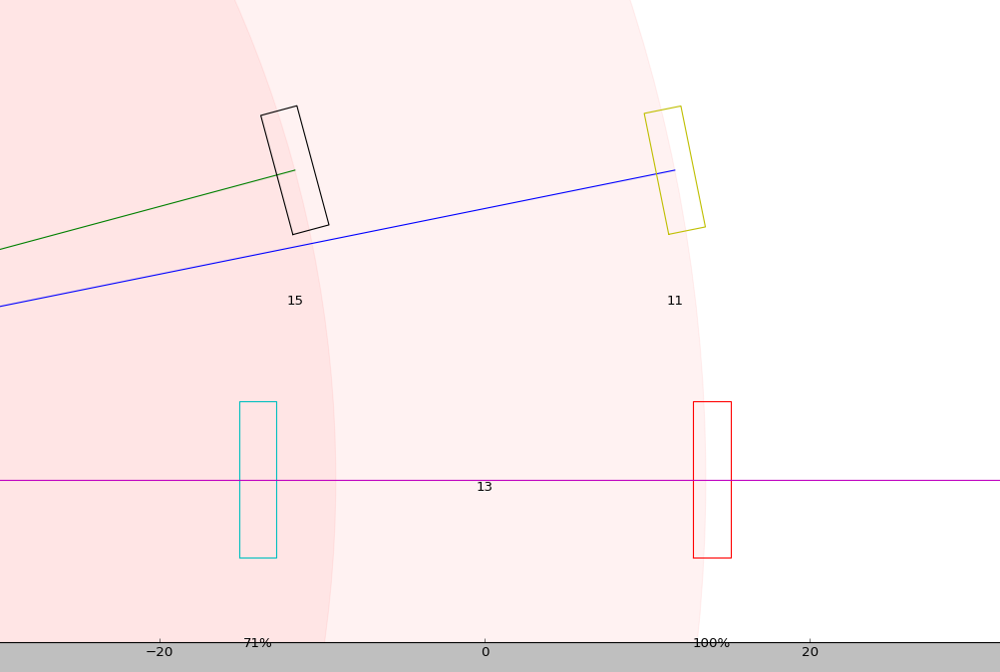
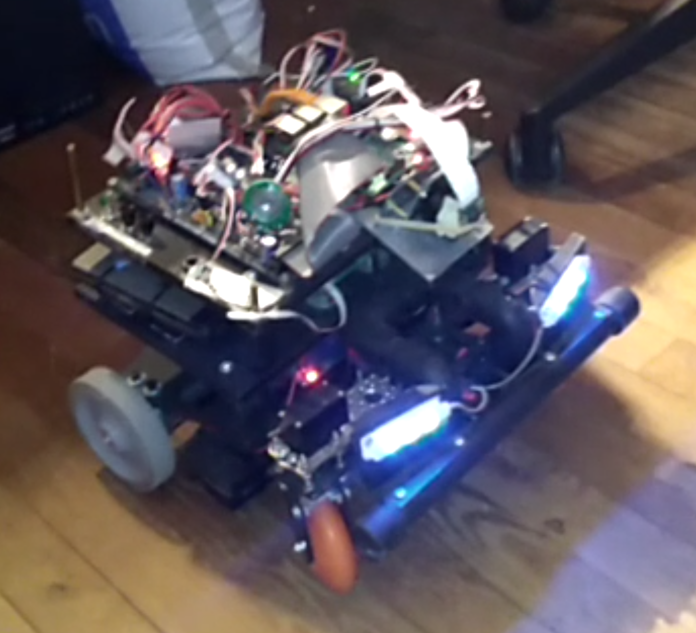
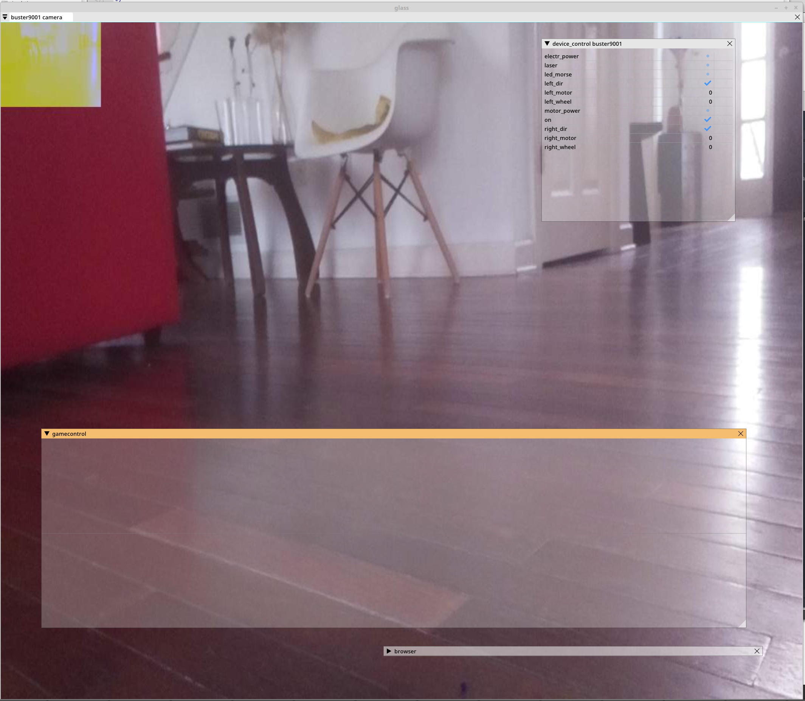

Buster wheel control.
=================================
Both front wheels are controlled independently by own servo and both back wheels by own motor.
We need to calculate direction for front wheels and speed for back wheels.

   Wheel control calculation buster/calc folder. 

This code doesn't handle numerical ambiguities:

:: 

        # "steering" input from -90 degrees (right) to 90 degrees (left) is for direction. 0 = straight forward.
        # "speed" is movement speed from -100% (backwards) to 100% (forward).
        speed = 100
        steering = 5

        # Calculate center_x on back wheel axis as rotation center.
        a = coeff * steering
        center_x = f_wheel_y / math.tan(a)

        # Calculate wheel directins in radians and convert to degrees
        ar = math.atan((f_wheel_y)/(center_x - f_wheel_x))
        al = math.atan((f_wheel_y)/(center_x + f_wheel_x))
        r_dir = ar/coeff
        l_dir = al/coeff

        # Calculate motor speeds, sl is left motor speed and sr right motor. Positive values forward and negative back.
        if center_x > b_wheel_x:
            sl = speed
            sr = sl * (center_x - b_wheel_x) /  (center_x + b_wheel_x)
        elif center_x < -b_wheel_x:
            sr = speed
            sl = sr * (-center_x - b_wheel_x) /  (-center_x + b_wheel_x)
        elif center_x > 0:
            sl = speed * (center_x + b_wheel_x) / (2 * b_wheel_x)
            sr = -sl * (b_wheel_x - center_x) /(b_wheel_x + center_x)
        else:
            sr = speed * (-center_x + b_wheel_x) / (2 * b_wheel_x)
            sl = -sr * (b_wheel_x + center_x) /(b_wheel_x - center_x)

   Prototyping and testing. 

   Wheel control (game controller widget). 

