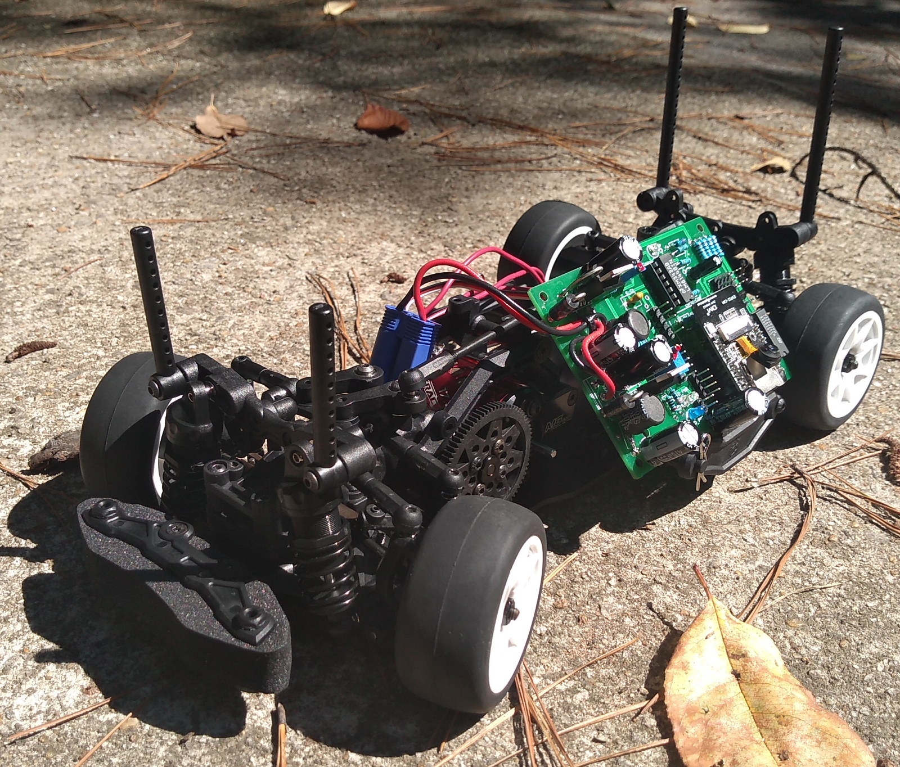

Candy 3-Racing RC car.
=================================
This test/demo is based on 3-racing RC car kit.

   Candy board can show camera and control throttle/steering on RC car, etc. 

   Open SCAD makes 3D design be like programming. It can render (F6) and export (file, export) a design as .stl file.

   Ultimaker opens the .stl file and slices it as 3-printable code for specific printer. This can be saved to printer's SD card and printed from there. 
