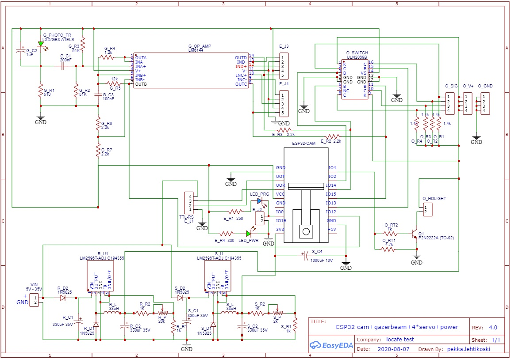
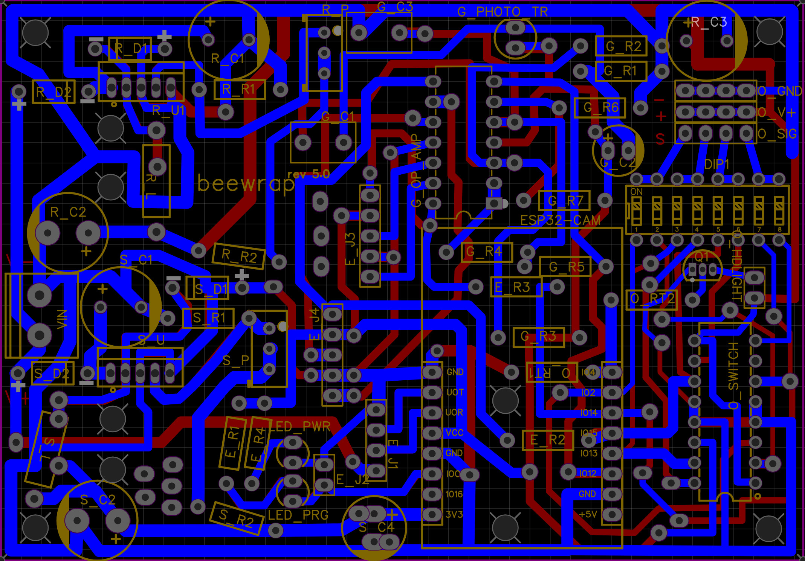
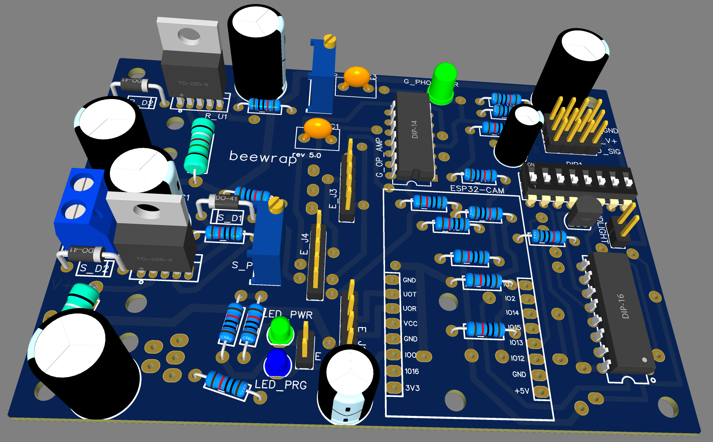
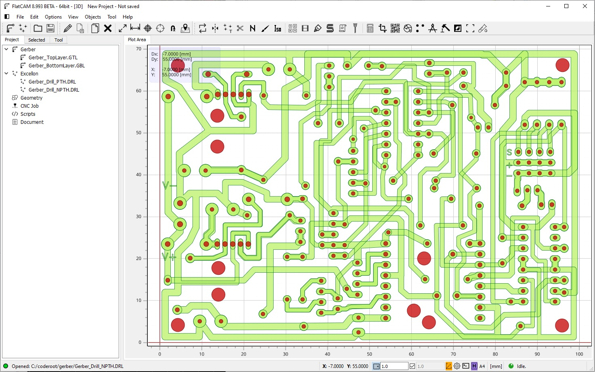
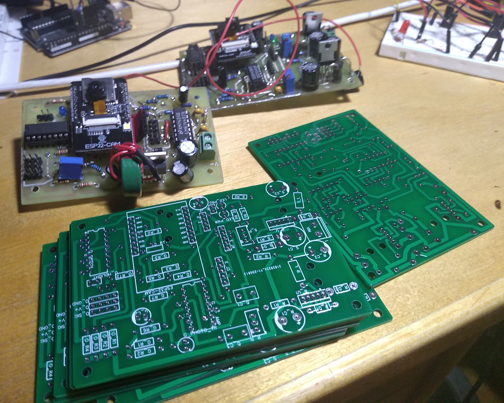
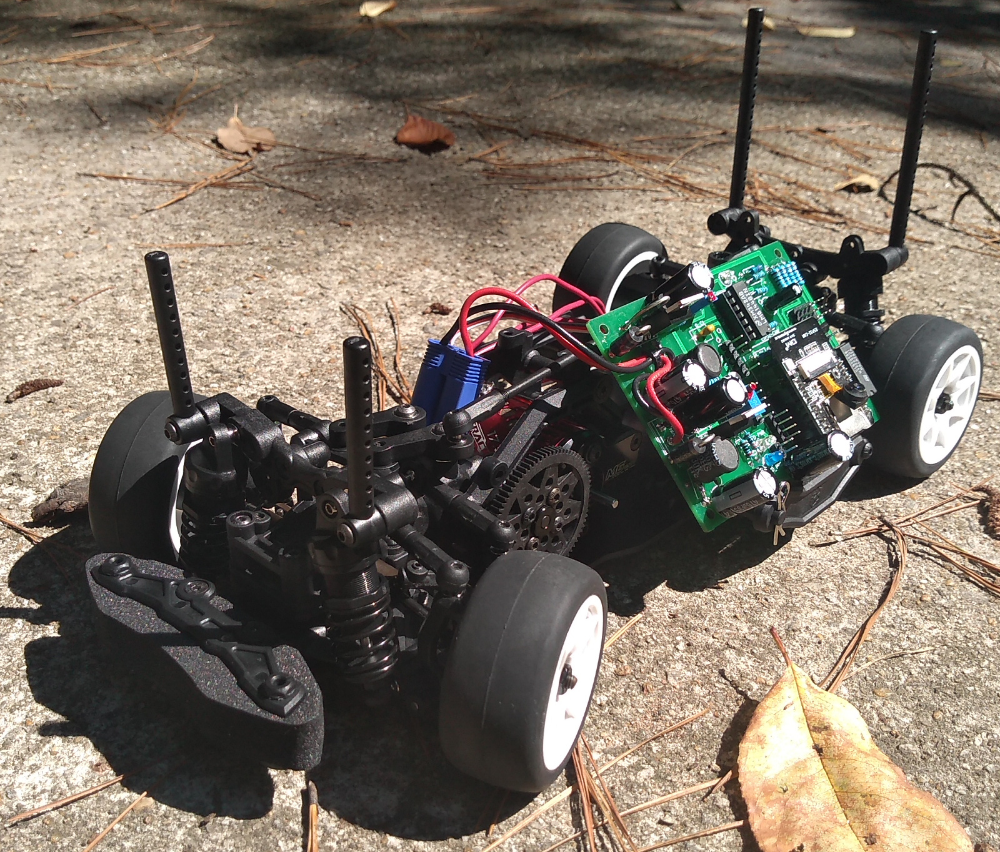
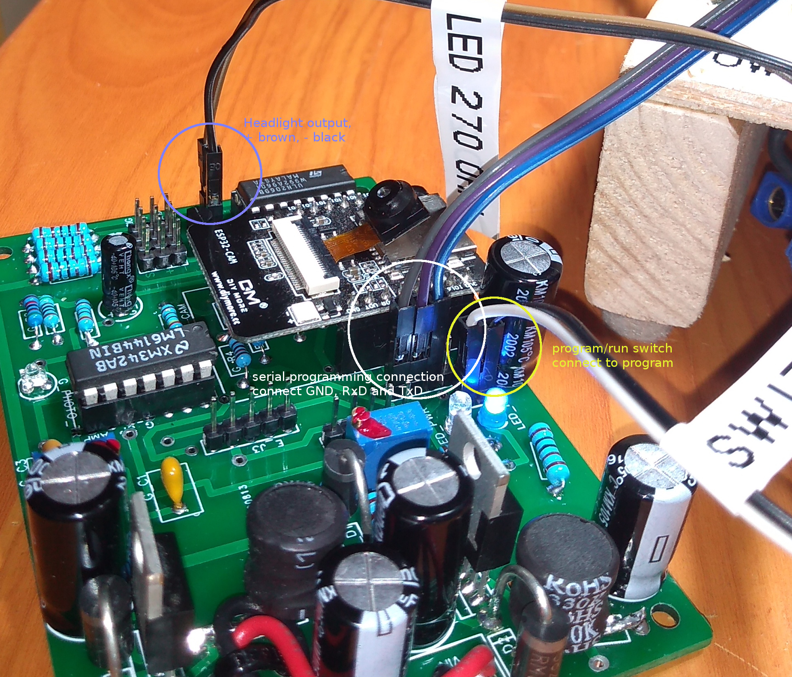

Candy ESP32 hardware.
=================================
I used EasyEDA to make Candy ESP32 test PCB, here some pictures.

   Schema. 

   Drawing PCB on copper.

   Board 3D layout.

   FlatCam can be used to create files for CNC, to drill holes or to machine the PCB

   Home made prototypes and PCBs from JLCBCB (ordered trough EasyEDA)

   Candy board can show camera and control throttle/steering on RC car. 

   Candy board serial programming wiring, etc. 

.. figure:: pics/210816-candy-esp32-cam-serial-programming-adapter-wiring.jpg

   Serial adapter wiring to candy board (3.3V level). 
