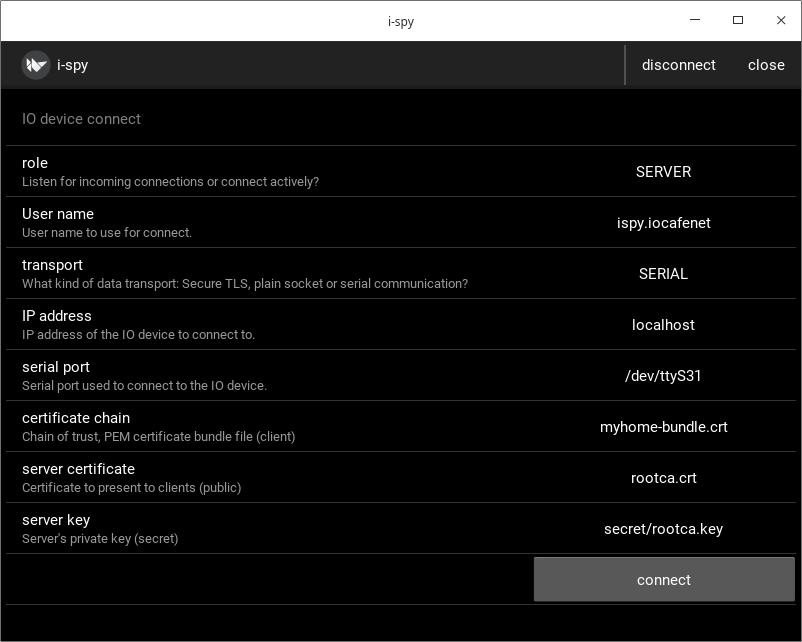
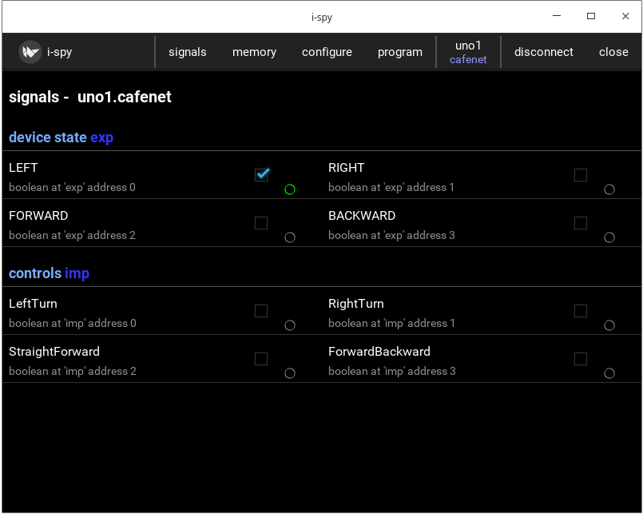

Uno - Arduino UNO with serial communication
=============================================================

Uno is used to test and demonstrate running IOCOM in very minimal hardware. Arduino UNO comes with 2kB of RAM
and limited flash memory. I do not really recommend Uno, it's  limited resources make it tricky to program
and troubleshoot. Something like bluepill is generally an easier choice. 

The IOCOM needs to be build with OSAL_MINIMALISTIC flag for real Uno hardware. The flag leaves only bare 
bones serial communication.

This example uses iocom/eosal entry point and loop functions, so that same code builds on linux.
Normal Arduino ones could be used as well. This may be more readable option, since common Arduino
framework is more clearly visible and calls to iocom like any library calls. 

Using iSpy to test testing code in linux
*****************************************
It is good idea to test that all runs in linux PC before trying anything on real hardware.

Create pair of imaginary serial ports connected to each others, see Testing serial communication with socat.
for me these ports are /dev/ttyS30 (uno) and /dev/ttyS31 (iSpy). 
We practically always use 115200 bps, 8 bits, no parity, 1 stop bit, no handshake. If nothing is mentioned
assume that this is the case.

notes:

* Setting  permissions for socat ports is important, and ports may not appear as 2 and 3 in /dev/pts, for me these were now 3 and 4.

Setup iSpy to listen serial communication from /dev/ttyS31
*************************************************************

notes: 

* You may need to build iocompython in /coderoot/iocom/extensions/iocompython. 
* iSpy can be started "cd /coderoot/iocom/extensions/iocompython/examples/ispy" and "./ispy.sh".

Start "uno" in linux PC
************************
Open uno in your C development environment.
Make sure that serial port is "ttyS30", etc in uno.c.

I see it working:

notes 23.1.2021/pekka

