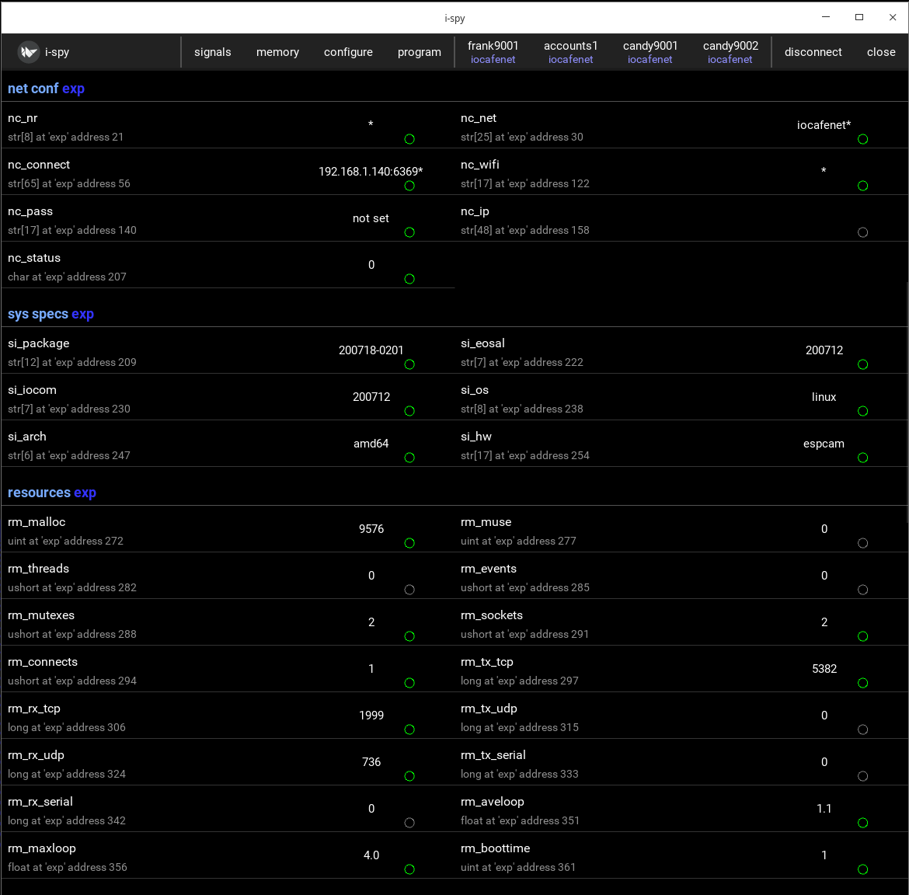

deviceinfo - publish device information
========================================
deviceinfo is iocom extension library to publish device's network configuration and state, software versions,
used operating system and hardware, and resource/performance counters.

* Network configuration and state
* System specification
* Resource monitor

   Device info signals viewed in ispy test application.

Network configuration
**********************

These signals are used both to display device's current network configuration and modify it. 

Merge default network configuration signals into application's signal map. For example candy camera's
/coderoot/iocom/examples/candy/config/signals/merge.json file includes node_conf_wifi.json:

::

    {"merge": ["signals.json", "node_conf_wifi.json", "device_conf_signals_1k.json"]}

Allocate static structure for network configuration info.

::
    
    static dinfoNodeConfState dinfo_nc;

Initialize network configuration state structure. This stores signal pointers to dinfo_nc structure. This can be called
during application initialization, from osal_main(), etc.

:: 

    DINFO_SET_COMMON_NET_CONF_SIGNALS_FOR_WIFI(nc_sigs, candy);
    dinfo_initialize_node_conf(&dinfo_nc, &nc_sigs);

After memory blocks have been created, the dinfo_set_node_conf() function needs to be called. It takes
several structures set up by nodeconf library as arguments. 

::

    dinfo_set_node_conf(&dinfo_nc, device_id, connconf, nics, wifis, security);

Call dinfo_run_node_conf() periodically, for example from main loop. This checks if configuration 
changes need to be saved, or device needs to be rebooted, etc. 

::

    os_get_timer(&ti);
    dinfo_run_node_conf(&dinfo_nc, &ti);

Actual network configuration signals do vary depending if we have WiFi, can use static IP, number of network
adapters, etc. The merged JSON file in this example is for device with WiFi and static IP configuration 
disabled. 

* Value ending with asterisk '*' means that it is automatically determined, like IP address to
  connect to from light house, or IO network name from server. 
* Ending '^' indicates that value has been modified, but the change is not yet applied (will be
  activated on next reboot). 

|

.. list-table:: Current network configuration as signals
  :widths: 25 75
  :header-rows: 1

  * - signal name
    - description
  * - nc_nr
    - Device number.
  * - nc_net
    - IO device network name.
  * - nc_connect
    - IP address (or host name) and port of a server to connect to. Port is optional. Single '*' indicates that 
      light house will be used to find server, but it has not been found yet. String ending with
      '*' means IP address determined to by lighthouse. Ending '^' indicates new user setting.
  * - nc_wifi
    - WiFi network name (SSID).
  * - nc_pass
    - WiFi password, only new set value is shown (pre shared key).
  * - nc_ip
    - Network address, like "192.168.1.220". This can be static IP address set by user,
      IP address by DHCP (indicated with '*') or new set value for IP address (indicated with  '^').
  * - nc_status
    - Zero indicates that all is fine. Other values indicate an error code. Error codes are the same as 
      blinked by IO device LED's morse code, etc. 

|

Network configuration can be modified by user (reboot activates). There are registers to do this

.. list-table:: Signals for setting network configuration, etc.
  :widths: 25 75
  :header-rows: 1

  * - signal name
    - description
  * - set_nc_nr
    - Set IO device number. 
  * - set_nc_net
    - Set IO device network to connect to, like "iocafenet".
  * - set_nc_connect
    - Set ip address (or host name) to connect to. TCP port number separated by colon ':' can be appended
      to IP address.
  * - set_nc_wifi
    - Set WiFi network name (SSID).
  * - set_nc_pass
    - Set WiFi password (pre shared key).
  * - reboot
    - Set to 1 to reboot the IO device now.
  * - forget_it
    - Set to 1 to wipe out security secret. 
  * - factory_rst
    - Set to 1 to wipe out all device's memory. 

|

System specification
**********************

An IO device specification lists installed software version, operating system, processor hardware architecture,
and IO board hardware. These are needed for user information, for checking is an software installation package 
can be loaded to the device, and in future for automatic software upgrades or recommendations.

Merge default system specification signals into application's signal map. For example candy camera's
/coderoot/iocom/examples/candy/config/signals/merge.json file includes system_specs.json:

::

    {"merge": ["signals.json", "system_specs.json", "device_conf_signals_1k.json"]}

Set signal pointers for system specification at startup code after memory blocks have been created.
The system specification is static information, no run function, etc. is needed. 

    dinfoSystemSpeSignals si_sigs;
    DINFO_SET_COMMON_SYSTEM_SPECS_SIGNALS(si_sigs, candy);
    dinfo_set_system_specs(&si_sigs, CANDY_HW);

|

.. list-table:: System specification signals
  :widths: 25 75
  :header-rows: 1

  * - signal name
    - description
  * - si_package
    - Installation package version, by convention this is date/time string "YYMMDD-HHMM". This type of version
      identifier is generated automatically at build time. To make this work nicely, the installation package 
      should be generated during same day as software was compiled. In this case date part of version identifier
      matches. Other version identifications can be used.
  * - si_eosal
    - EOSAL library version, this is date string "YYMMDD" to allow referencing to Github repo. 
  * - si_iocom
    - IOCOM library version, this is date string "YYMMDD" to allow referencing to Github repo. 
  * - si_os
    - Operating system name, at the time of writing "win32", "win64", "linux", "esp32" are somewhat implemented.
  * - si_arch
    - Processor hardware architecture for which the installation package was built. This is recorded at
      software build, not run time. At time of writing the choices are"amd64", "x86", "arm64", "arm", "esp32",
      but more will be added.
  * - si_hw
    - IO device hardware name. This can be any name chosen to describe the hardware, "generic" should be used
      for applications which do not have dependency to IO pins, etc.  Hardware and device name together should
      refer to a specific IO board with specific function for used IO pins. 

|

Resource monitor
*****************

Compile time EOSAL define OSAL_RESOURCE_MONITOR=1 enables EOSAL library code to keep track of resource use.
See osal_resource_monitor.h. The deviceinfo library calculates loop timing and publishes that and information
collected by EOSAL as IO signals

Merge default resource monitor signals into application's signal map. For example candy camera's
/coderoot/iocom/examples/candy/config/signals/merge.json file includes resource_monitor.json:

::

    {"merge": ["signals.json", "resource_monitor.json", "device_conf_signals_1k.json"]}

Allocate static structure for resource monitor.

::
    
    static dinfoResMonState dinfo_rm;

Initialize resource monitor structure. This stores signal pointers to dinfo_rm structure. This can be called
during application initialization, from osal_main(), etc.

:: 

    dinfoResMonSignals rm_sigs;
    DINFO_SET_COMMON_RESOURCE_MONITOR_SIGNALS(rm_sigs, candy);
    dinfo_initialize_resource_monitor(&dinfo_rm, &rm_sigs);

Call dinfo_run_resource_monitor() from main loop. This keeps the resource monitor signals alive.  

::

    os_get_timer(&ti);
    dinfo_run_resource_monitor(&dinfo_rm, &ti);

|

.. list-table:: Resource monitor signals
  :widths: 25 75
  :header-rows: 1

  * - signal name
    - description
  * - rm_malloc
    - Operating system memory allocated by EOSAL, bytes. 
  * - rm_muse
    - How much of memory allocated through/by EOSAL is in use. The os_malloc() adds to used memory and os_free() releases it. 
  * - rm_threads
    - Number of threads created trough EOSAL.
  * - rm_events
    - Number of events created tough/by EOSAL.
  * - rm_mutexes
    - Number of mutexes created tough/by EOSAL.
  * - rm_sockets
    - Number of sockets currently allocated trough EOSAL, including connected sockets, listening sockets and UDP sockets.
  * - rm_connects
    - Number of TCP socket connects. This number is incremented at every connection and never decremented. Listening sockets
      and UDP sockets do not affect to this. 
  * - rm_tx_tcp
    - Number of bytes sent to a connected TCP socket.
  * - rm_rx_tcp
    - Number of bytes received from a connected TCP socket.
  * - rm_tx_udp
    - Number of bytes sent through UDP socket.
  * - rm_rx_udp
    - Number of bytes received from UDP socket.
  * - rm_tx_serial
    - Number of bytes sent to a serial port or blue tooth.
  * - rm_rx_serial
    - Number of bytes received from a serial port or blue tooth.
  * - rm_aveloop
    - Average main loop period, ms. For example if main loop runs 1000 times per second, this is 1 ms.
  * - rm_maxloop
    - How long the slowest single round of main loop took within testing period.
  * - rm_boottime
    - How many minutes ago the software started (device booted). Useful to ensure that there are not
      unintended device reboots.

|

Build application with deviceinfo library
******************************************
Directory /coderoot/iocom/extensions/deviceinfo need to be in included path, then include deviceinfo header.

::

    #include "deviceinfo.h"

Link with deviceinfo or deviceinfod (debug) library. Libraries are in /coderoot/lib directory by operating system.
The deviceinfo library depends on EOSAL and IOCOM.

200717, updated 17.7.2020/pekka
