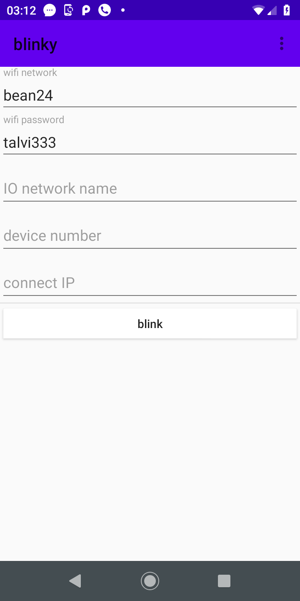
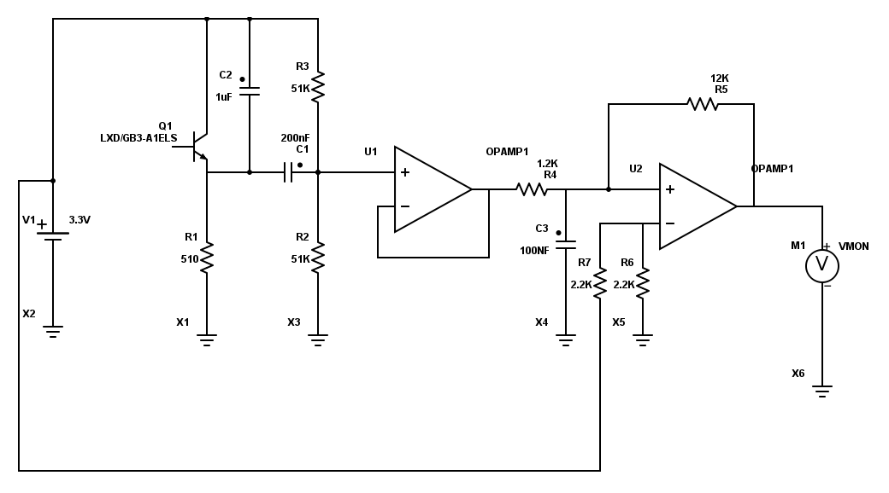
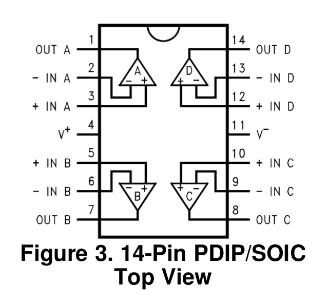
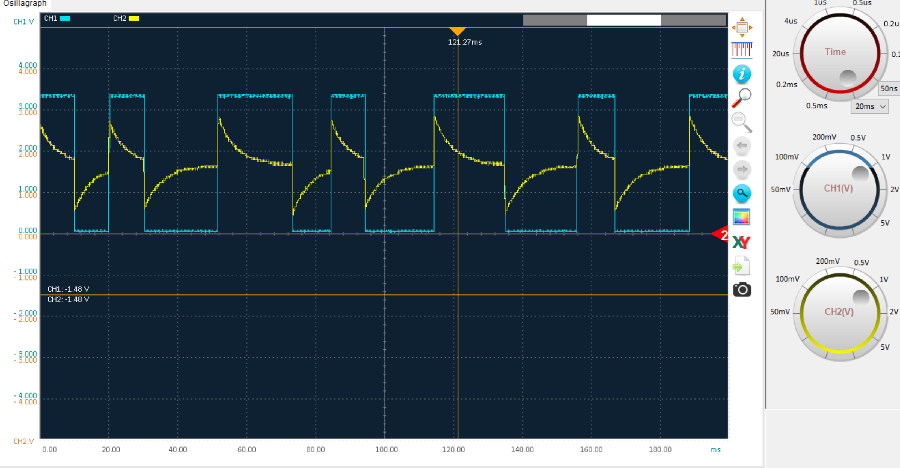
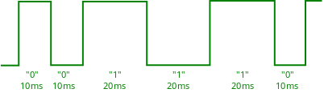

Set up micro-controller's WiFi with Android phone
=================================================

Introduction
************
The “Gazerbeam” library enables configuring micro-controller's Wi-Fi network name (SSID) and 
password (PSK) using LED flash of Android phone, etc. 

* The phone needs APP to blink configuration information, example Android Java application named “blinky”.
* A photo transistor is connected to micro-controller with simple high pass filter/digitalization electronics. 
* Micro-controller gets signal from electronics as digital input. It is set up so that changes to the signal
  trigger interrupt. Gazerbeam library handles this and converts it to message.
* The transferred data is encoded into light signal using short and long intervals between light on/off changes

Android application
*********************
Android application Blinky, is simple: To provide user form to fill in WiFi network name, 
password and other optional configuration settings. When user fills these in and clicks “blink” 
button, the app starts sending this data repeatedly with LED flash until the “blink” button is 
clicked again.

   Set WiFi network name and password in Android Phone.

The android application’s Java code is in iocom/extensions/gazerbeam/examples/blinky directory.

Electronics
***********
An LM6144 operational amplifier (U1 and U2) is used to high pass and to digitize the signal 
of LXD/GB3-A1ELS photo transistor (Q1).

   electronics schema

The first operation amplifier U1 does high pass filtering of the signal. This removes ambient
light and centers the signal at 1.65V.

The U2 is comparator, which compares if input voltage is less or greater than 1.65 V changes 
the voltage to 0V or 3.3V (roughly) Resistor R5 adds a threshold to change output state, 
to prevent output from filtering. In addition there is mild low pass filtering by RC circuit C3/R4.

   operation amplifier

.. figure:: pics/200319-photo-transistor.jpg
   :width: 330

   photo transistor

   scope view

Yellow is high pass filtered signal after first OP-amp U1. The blue is digitalized signal after 
second OP-amp U2. 

Signal and data encoding
************************
An Android phone can only turn flash on or off, the shortest pulse which can be reliably generated 
is approximately 10ms. This is enough, amount of data to be transferred is small. Typically WiFi 
network name and password, and optionally some extra information.

Zero and one bits 
~~~~~~~~~~~~~~~~~
When sending Android’s LED keeps on turning on and off continuously. What matters is how long LED 
stays in same state: 10ms for “0” bit and 20 ms for “1” bit. So time between transitions matters,
direction of transition is ignored. If doesn’t matter if LED switches from on to off or vice versa.

   signal timing

The Gazerbeam receiver is not very time critical, timing can be changed quite much and it should 
still work. Pulse length is recorded on fly and basic rule is that “1” must be clearly longer 
than “0”. Anyhow if taken very far from tested, the high pass filtering RC may need to be adjusted.

From bits to messages
~~~~~~~~~~~~~~~~~~~~~
A message contains all data what user entered and is repeated endlessly: Android application doesn’t
know when it is received by micro-controller.

* The message starts with 14 zero bits and then one bit, like “000000000000001”. 
* Then the 7 data bit for each data byte follow, least significant bit first. 
* The data transferred is 7 bit ASCII with legitimate values from 1 to 127, it can never form
  nine consequent zeros and can be separated from beginning of message. Like “0101010”.
* There is no message length. Previous message is processed when a new message begins, at
  that point the previous message is considered “ready”.
* First three data bytes contain always checksum (MODBUS CRC), less significant byte first.
  First byte contains 6 least significant bits + 1, next byte 6 bits + 1 and the third byte 4 bits + 1. 

Message content - fields
~~~~~~~~~~~~~~~~~~~~~~~~
The message starts with three byte checksum. This needs to be generated by Android code, 
and is checked and stripped away by the Gazerbeam library. 

Following the check sum there are 1 or more fields:

    • A field starts with field id byte.
    • Next byte is field data length, specifies number of data bytes.
    • N data bytes, ASCII codes from 1 to 127

The field IDs are (list here)

200318, updated 20.5.2020/pekka
