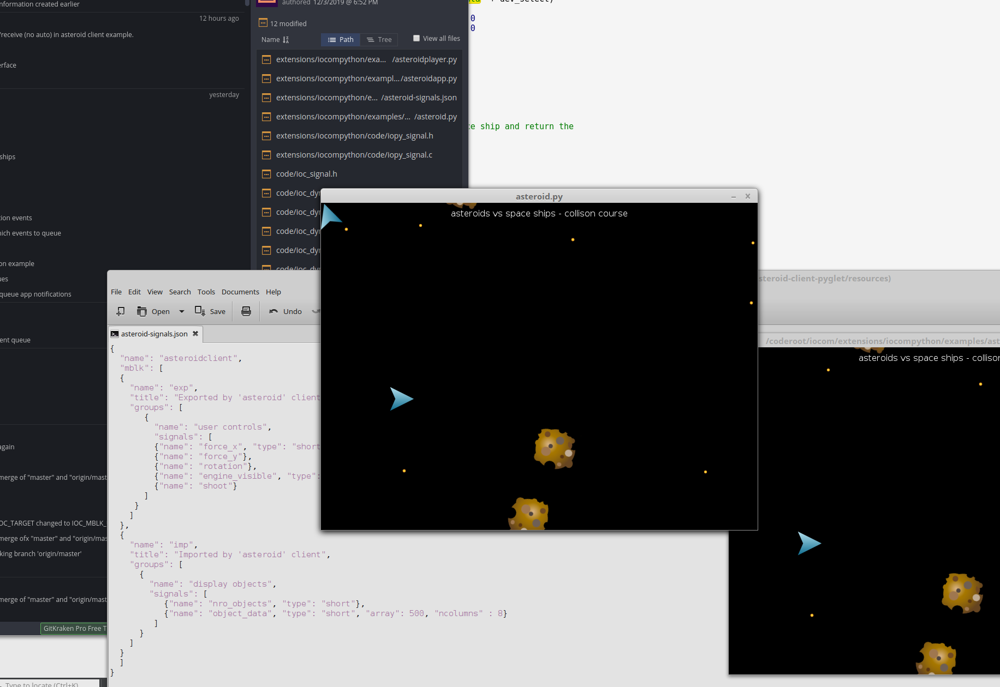

IOCOM in simple multi player game?
===================================
This test code/example is for IOCOM network topology using Python API (iocompython) and Pyglet game UI library. Network topology for a multi player game can be very similar to IO device network: I run server side app (also python/iocompython) in Amazon’s AWS and client side in my computers. The “game arena” is analogous to “IO device network” and “player” to “IO device”. 

   asteroid game.

On server side
*********************
It is was easy. Amazon EC2 is like Linux computer (virtual one tough) to which I connect with putty terminal. Necessary software like git, cmake, python3-dev, etc. can be just installed to AWS machine by typing “sudo yum install git….” to pytty terminal. Then I use “git clone..”  to get “/coderoot/iocom” and “/coderoot/eosal” source code. The iocompython C code /coderoot/iocom/extensions/iocompython builds with cmake to “/coderoot/bin/linux/iocompython.so” on linux (or bin/win32/iocompython.pyd” on windows). 

To run the Asteroid game server, use  in “iocompython/examples/asteroid-service/asteroidservice.sh”.

On client side.
*********************
The “/coderoot/iocom/extensions/iocompython” C code needs to be compiled for client environment, this makes the Python module. Asteroid game’s client side Python code is in “iocompython/examples/asteroid-client-pyglet”.  

Linux notes:
*********************
Note 1: Build and run dependencies (already in dev. virtual machine)
    • sudo apt-get install cmake
    • python (3.5 or newer preferred)
    • pyglet: python3 -m pip install pyglet

Note 2: Build iocompython from C code 
    • cd /coderoot/iocom/extensions/iocompython
    • mkdir tmp
    • cd tmp
    • rm -R *
    • cmake -DCMAKE_BUILD_TYPE=Release ..
    • make

Note 3: Check build result
    • ls -la /coderoot/bin/linux/iocomp*
    • ==> -rwxr-xr-x 1 pekka pekka 244056 Dec 26 22:12 /coderoot/bin/linux/iocompython.so

Note 4: Start asteroid test service
    • open new terminal
    • cd /coderoot/iocom/extensions/iocompython/examples/asteroid-service
    •  ./asteroidservice.sh

Note 5: Start asteroid test client
    • open new terminal
    • cd /coderoot/iocom/extensions/iocompython/examples/asteroid-client-pyglet
    • nano asteroid.py
    • modify line connection = Connection(root, "127.0.0.1", "tls,up") to have numeric IP address of computer running the asteroid service. 127.0.0.1 is in same computer. Save the file and close gedit.
    • ./asteroid.sh

Note 6: General 
    • Line  "import pyglet" in .py imports game graphics library "Pyglet".
    • Python starts with command python3 Python.
    • Ofter several different Python 3 versions are installed in same computer, so sometimes we use "/usr/bin/python3" and sometimes just “python3” to start Python.
    • Python needs to find /coderoot/bin/linux/iocompython.so. To make this happen environment variable "export PYTHONPATH=/coderoot/bin/linux" is set. 
    • Startup script ending with “.sh” sets PYTHONPATH and starts asteroid test application "/usr/bin/python3 asteroid.py"

191202, updated 24.5.2020/pekka
