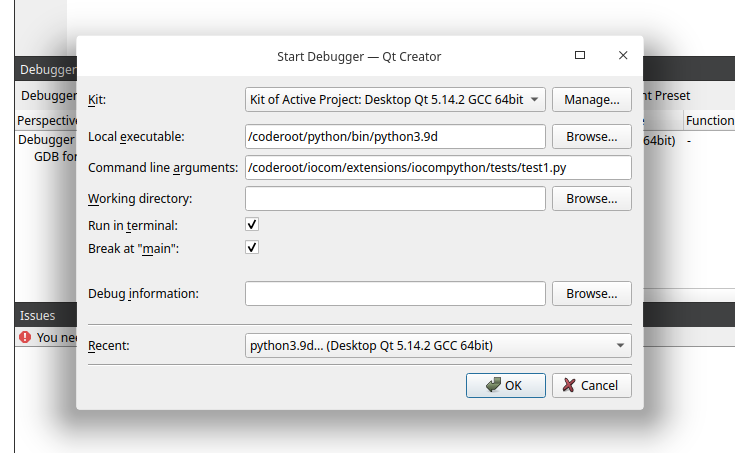

iocpython - python build
===================================
Used for debugging python C extensions.

Directories
************

::

    /coderoot/cpython Python source code cloned from GitHub
    /coderoot/python Installation of self compiled python

Install dependencies
*********************

::

   sudo apt-get update
   sudo apt-get install build-essential 
   sudo apt-get build-dep python3.8

Alternatively, or in addition (you can these also if uncertain)

::
   
   sudo apt-get update \
      && sudo apt-get install -y build-essential git libexpat1-dev libssl-dev zlib1g-dev \
     libncurses5-dev libbz2-dev liblzma-dev \
     libsqlite3-dev libffi-dev tcl-dev linux-headers-generic libgdbm-dev \
     libreadline-dev tk tk-dev   
  

Clone python sources from Github
*********************************

::

    cd /coderoot
    git clone https://github.com/python/cpython.git

Select python release
**********************
Compile stable branch, I select python version 3.9. 

::

    cd /coderoot/cpython
    git checkout 3.9

Build
******

::

    cd /coderoot/cpython && ./configure --prefix=/coderoot/python \
      --enable-loadable-sqlite-extensions \
      --enable-shared \
      --with-lto \
      --enable-optimizations \
      --with-system-expat \
      --with-system-ffi \
      --enable-ipv6 --with-threads --with-pydebug --disable-rpath \
      && make 

Install
********
Compiled Python will be installed in /coderoot/python

::

	cd /coderoot/cpython
	make install

Test that it works
*******************

::

    cd /coderoot/python/bin
    export LD_LIBRARY_PATH=/coderoot/python/lib
    ./python3.9

Debug Python with QT creator 
******************************
QT creator needs to be started with script which sets LD_LIBRARY_PATH and PYTHONPATH do that debugging works

::
    
    /coderoot/iocom/extensions/iocompython/scripts/start-qtcreator-for-python-debug.sh

Select [Debug][Start Debugging][Start and Debug External Application].
Set Python program to debug as command line argument.

   debug python as external application.
