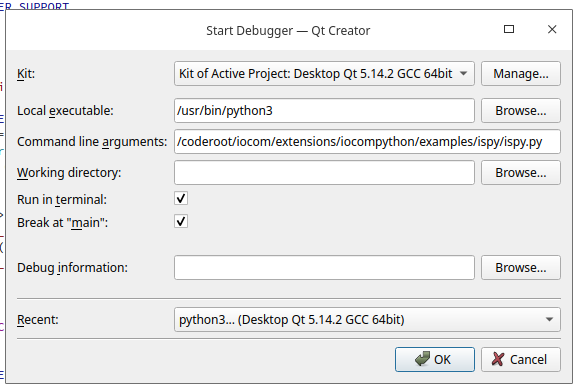

Debuggin Python API C extension (iocompython) 
===================================================================

Install dependencies
*********************

::

   sudo apt-get update
   sudo apt-get install build-essential 
   sudo apt-get build-dep python3.8
   sudo apt-get install python3-dev

Just to make it doubly sure that we got all, run

::
   
   sudo apt-get update \
      && sudo apt-get install -y build-essential git libexpat1-dev libssl-dev zlib1g-dev \
     libncurses5-dev libbz2-dev liblzma-dev \
     libsqlite3-dev libffi-dev tcl-dev linux-headers-generic libgdbm-dev \
     libreadline-dev tk tk-dev   
  

Installing Kivy
****************
Kivy from "master" branch must be used, older did not work with Python 3.8, etc new stuff (30.5.2020). 
I needed to run install also with sudo to make installation complete "sudo pip install kivy[base]..." ? 

::

    sudo apt-get install -y ffmpeg libsdl2-dev libsdl2-image-dev libsdl2-mixer-dev libsdl2-ttf-dev 
    sudo apt-get install -y libportmidi-dev libswscale-dev libavformat-dev libavcodec-dev zlib1g-dev
    sudo apt-get install libjpeg-dev
    
    pip install kivy[base] kivy_examples --pre --extra-index-url https://kivy.org/downloads/simple/

Debug Python with QT creator 
******************************
QT creator needs to be started with script which sets LD_LIBRARY_PATH and PYTHONPATH do that debugging works.

* Select run in terminal if opening from file explorer.
* Remember to build DEBUG version of iocompython.
* Here debugging with Python code /coderoot/iocom/extensions/iocompython/examples/ispy/ispy.py

::
    
    /coderoot/iocom/extensions/iocompython/scripts/start-qtcreator-for-python-debug.sh

Select [Debug][Start Debugging][Start and Debug External Application].
Set Python program to debug as command line argument.

   debug python as external application.

