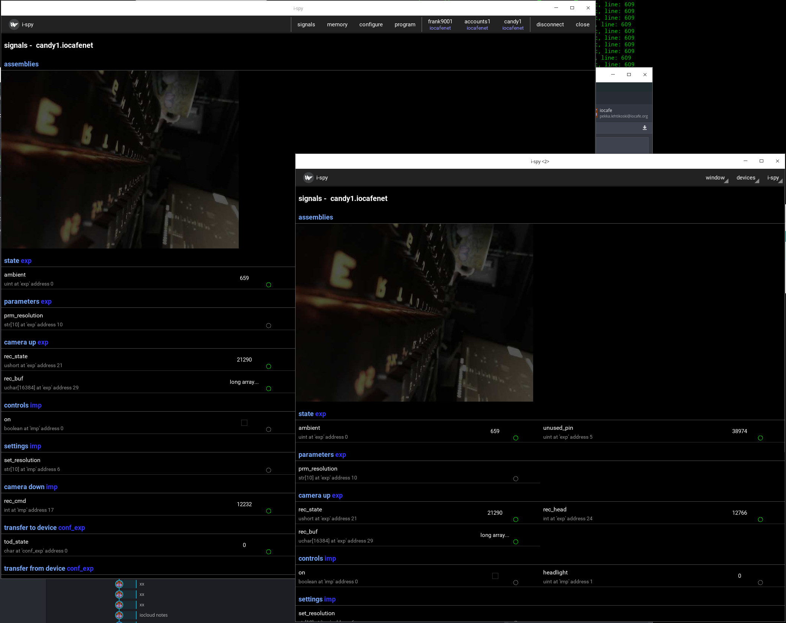

ISPY - example and configuration/test tool
===========================================
ispy was intended as example program how to use IOCOM data in Python/Kivy UI application, but since we needed some kind of user interface for
development, it gradually took this role. This adds complexity, which reduces ispy's usefullness as example,

   ispy screenshot, connected to candy camera.

200609, updated 9.6.2020/pekka
