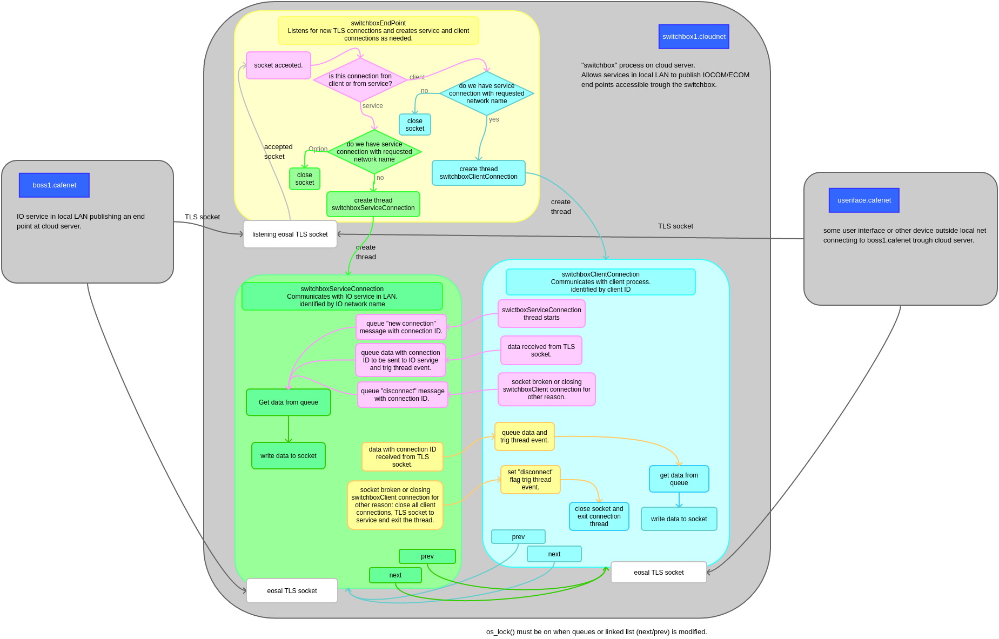

switchbox
==================================

The switchbox library is intended for writing a pass-trough service to connect to set of IO networks.

Connection netween IO network service in local LAN and switchbox service in cloud
- IO network service on local LAN established TLS connection to switchbox service. IO network name of local service is used to label this connection at switchbox, for example as "pekkanet", etc. 
- The ioc_switchbox_socket class manages this TLS connection at IO network service end. 
- Note: "IO network name" is used for IOCOM. 

IO device connects to IO network trough cloud server
- An IO device or other client connect first to switchbox service in cloud.
- This connection is normal IOCOM or ECOM TLS connection, requested IO network is specified in handshake header. 
- When switchbox server recives a socket connection, it checks if this IO network service with given network name
  is connected. If so, it generates a pass-trough to it. If not, the client connection is dropped.
- Switchbox sends "new connection" message to IO server in local LAN. The IO server needs to create a IOCOM or ECOM connection object using switchbox socket class as transport.
- Data from IO device passtrough is forwared "as is" trough switchbox.

.. figure:: pics/210317-IO-service-connects-to-switchbox.png

   IO network service connects to switchbox.

ioc_switchbox_socket
**********************
The switchbox socket is part of iocom library. It is used by IO network service to forward it's connection end point to switchbox cloud server. 

The switchbox socket class implements EOSAL stream API  and is used as socket or other stream by iocom/ecom communication protocol to accept connections and to transfer data.
It tunnels data from from multiple socket clients connected to switchbox cloud server to IO network service in local network using single TLS socket. 
It doesn't interfere with communication protocol, protocol data is passed trough as is. Some additional framing data, like purpose of message, length and connection ID
is added. 

.. figure:: pics/210330-ioc-switchbox-socket-connecting-to-switchbox.png

   operation of switchbox socket (connects IO network service to switchbox in cloud). 

switchbox service 
**********************
The switchbox service runs on cloud server. It is implemented as iocom extension "switchbox", which is compiled inpu switchbox library. There is eobjects based main program eswitch, which
is general purpose switchbox service application and example how to use the switchbox library.

   operation of switchbox library (functional code that runs on cloud server). 

TODO:
*******

- Automatic establishment of trust. if server certificate verification fails in client, client requests certificate from server. More advanced processes, like user interface have parameters to control this and/or certificate still needs to be accepted by user.
- Automatic user accounts. Switchbox implementation can in some cases establish automatically user accounts with password. This is can be used for low security applications, like multiplayer game sharing trough cloud.  
