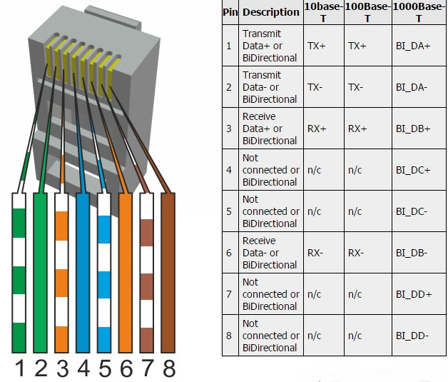
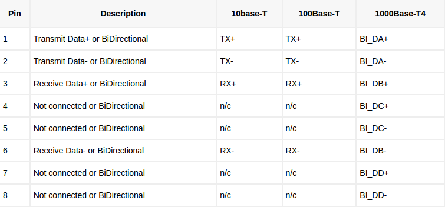

Ethernet connector v1
==================================

Ethernet connector is standard RJ-45. 

   Ethernet cable 10 Base-T, 100 Base-T, and 1000 Base-T4.

Pins 1,2,3 and 6 are always needed. Pins 4, 5, 7 and 8 are needed only for 1000 Base-T4.

   10 Base-T and 100 Base-T use TX and RX pairs (4 wires), and 1000 Base-T4 4 bidirectional pairs (8 wires).

1.8.2021/pekka
