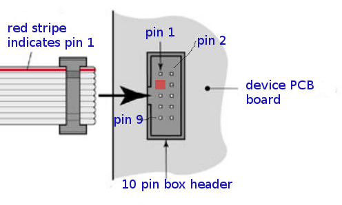

Power connector v1
==================================

Power connector is 2x5 FC-10P 2.54mm dual row IDC socket connector.

Power connectors soldered to both microcontroller and device PCB boards are male.
Ends of connecting cable are female. The cable is straight cable, and connects pin 1 to pin 1, pin 2 to pin 2...
Flat ribbon cable can be used.

   Power connector and cable orientation.

.. list-table:: Connector pinout
  :widths: 20 20 60
  :header-rows: 1

  * - pin nr
    - pin name
    - description
  * - 1, 2
    - GND
    - Ground.
  * - 3
    - NC
    - Not connected, used to avoid connecting wrong cable. Box header pin should be cut, and cable plugged for this pin.
  * - 4
    - CUSTOM
    - Reserved for custom use.
  * - 5, 6
    - 3.3V
    - Regulated 3.3V. 
  * - 7, 8
    - 5V
    - Regulated 5V, often 5.2V to allow some loss.
  * - 9, 10
    - unregulated V
    - Unregulated or higher voltage, for example 12V.

Cable to connect power to/from breadboard:
Excluding NC/CUSTOM pins, the pins are in pairs (pin 1 = pin 2, pin 5 = pin 6...) so the male 2 x 5 2.54mm pin strip can be pressed directly into bread board.

PCB modules which can be pressed into breadboard should have pins 1, 3, 5, 7, 9 from in this order.

1.8.2021/pekka
