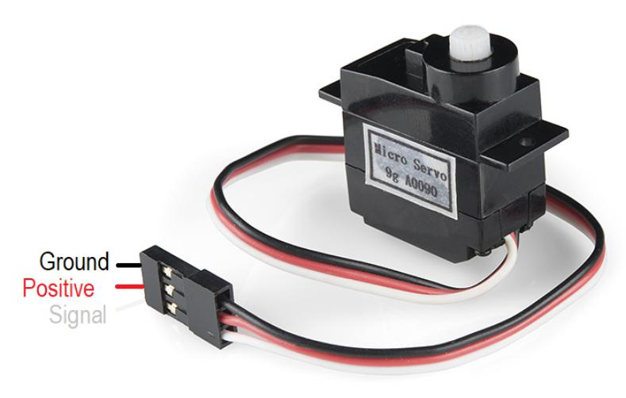

Servo connector v1
====================

The connector provides PWM position control and operating voltage to a servo or other device.
Servo connector is 1x3 2.54mm pin strip.

Microcontroller PCB board has male 3 pins.

   Generic servo and cable.

.. list-table:: Connector pinout
  :widths: 15 15 15 55
  :header-rows: 1

  * - pin nr
    - wire color
    - pin name
    - description
  * - 1 
    - black
    - GND
    - Ground.
  * - 2
    - red
    - VDC
    - Power for the servo, nominally 5V (4.8V - 6.0 V), but can be as low as 3.3 V.
  * - 3 
    - white
    - SIGNAL
    - PWM signal to control servo position. Pulse amplitude may be less than operating voltage in pin 2, down to 3V.

Servo control: The pulse frequency is typically 50 Hz, but the exact frequency does not matter. 
The servo position is controlled by changing pulse width. 1.5 ms corresponds to center point of the servo.
Shortening or lengthening the pulse (1.0 ms to 2.0 ms) will turn the servo.

Higher pulse frequency is used to control LED brightness and especially PWM audio.

1.8.2021/pekka
