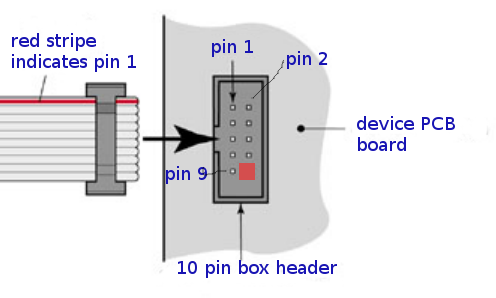

RS232 "3 wire serial" connector v1
==================================

RS232r connector is 2x5 FC-10P 2.54mm dual row IDC socket connector.

   RS232 connector and cable orientation

Both ends use same pinout, cross over needs to be in the cable. Pins 2, 3, and 5 must be connected.

.. list-table:: Connector pinout
  :widths: 20 20 60
  :header-rows: 1

  * - pin nr
    - name
    - description
  * - 1 
    - DCD
    - Data carrier detect (optional).
  * - 2
    - RxD
    - Received data.
  * - 3
    - TxD
    - Transmitted data.
  * - 4
    - DTR
    - Data terminal ready (optional).
  * - 5 
    - GND
    - Signal ground.
  * - 6
    - DSR
    - Data set ready (optional).
  * - 7
    - RTS
    - Request to send (optional).
  * - 8
    - CTS
    - Clear to send (optional).
  * - 9
    - RI
    - Ring indicator (optional).
  * - 10
    - NC
    - Not connected, used to avoid connecting wrong cable. Box header pin should be cut, and cable plugged for this pin.

1.8.2021/pekka
