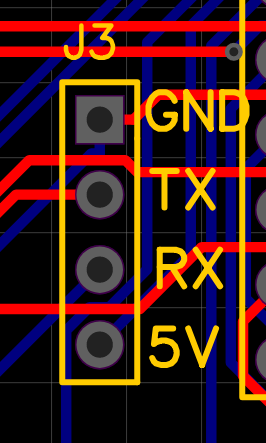

"TTL level" serial connector 
=================================

Connector is 1x4 pin strip, male pins on board. TTL level serial connection can be used for software uploads, trace prints and for communication to extension boards.

   "TTL level" serial connector on PCB.
   
.. list-table:: Connector pinout
  :widths: 20 20 60
  :header-rows: 1

  * - pin nr
    - name
    - description
  * - 1 
    - GND
    - Ground.
  * - 2
    - TxD
    - Transmitted data. Signal levels 0 and 3.3V.
  * - 3
    - RxD
    - Received data. Signal levels 0 and 3.3V.
  * - 4
    - 5V
    - 5V volt power to extension device. This is optional, and should have jumper to connect 5V or leave the pin unconnected.

29.8.2021/pekka
