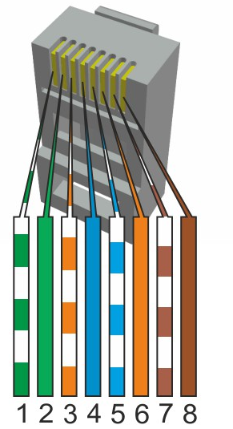
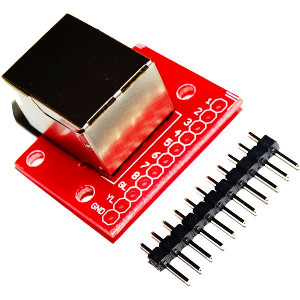

RS422 connector v1
==================================

RS422 uses standard RJ-45 ethernet connector. Pin order is selected so that cross over ethernet cable can be used.

   RS422 uses RJ-45 and ethernet cable.

Only pins 1,2,3 and 6 are needed. 

.. list-table:: Connector pinout
  :widths: 15 15 15 55
  :header-rows: 1

  * - pin nr
    - color
    - name
    - description
  * - 1 
    - green/white
    - TX+
    - Transmit data +.
  * - 2
    - green
    - TX-
    - Transmit data -.
  * - 3 
    - orange/white
    - RX+
    - Receive data +.
  * - 6
    - orange
    - RX-
    - Receive data -.

   RJ-45 breakout board can be used with bread board.

1.8.2021/pekka
