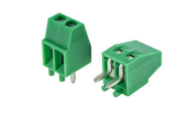

RS485 "2 wire serial" connector v1
==================================

RS485 two wire communication uses simple twisted pair.

   RS485 "two wire" uses simple screw connector.

.. list-table:: Connector pinout
  :widths: 20 20 60 
  :header-rows: 1

  * - pin nr
    - name
    - description
  * - 1 
    - DATA+
    - Data +.
  * - 2
    - DATA-
    - Data -.

1.8.2021/pekka
