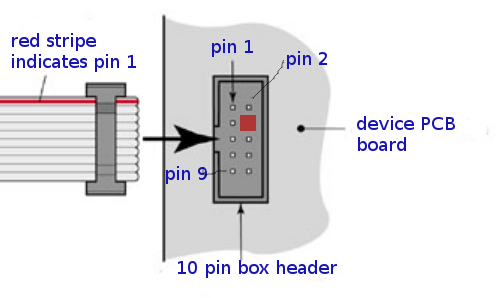
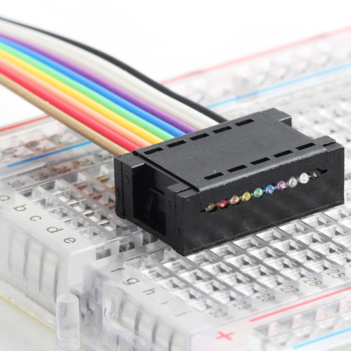

SPI connector A
==================================

Ready products use the SPI bus for communication between chips on same PCB, it is wired case by case.
Anyhow, while prototyping it is convinient to have a specified pinout: Connector for test PCBs and
specific pin order for breadboard. This allows switching SPI device - microcontroller setups quickly.

SPI interface uses 2x5 FC-10P 2.54mm dual row IDC sockets connectors.

Connectors soldered to both microcontroller and device PCB boards are male.
Ends of connecting cable are female. The cable is straight cable, and connects pin 1 to pin 1, pin 2 to pin 2...
Flat ribbon cable can be used.

   SPI connector and cable orientation - both controller board and device end the same pinout.

.. list-table:: Connector pinout
  :widths: 20 20 60
  :header-rows: 1

  * - pin number
    - pin name
    - description
  * - pin 1
    - GND
    - Ground.
  * - pin 2
    - 3.3V
    - SPI operating voltage, typically 3.3V. Controller board powers the device.
  * - pin 3
    - 5V
    - Controller board powers the device.
  * - pin 4
    - NC
    - Not connected, used to avoid connecting wrong cable. Box header pin should be cut, and cable plugged for this pin.
  * - pin 5
    - SCLK
    - SPI clock from controller (master) to device (slave).
  * - pin 6
    - MOSI
    - Data from controller to device, master out/slave in.
  * - pin 7
    - MISO
    - Data from device to controller, master in/slave out.
  * - pin 8
    - SS
    - Chip select, activates SPI device. This signal is inverted, the device is activated when this is 0V and deactivated when 3.3V.
  * - pin 9
    - GPIO A
    - Application specific GPIO pin A, optional. Specific use like display backlight control, etc.
  * - pin 10
    - GPIO B
    - Application specific GPIO pin B.

Cable to connect SPI IDC to breadboard:
Two separate "straight 1 x 5 pin strips" (pin numbers 1 - 5 and  6- 10) or one "breadboard friendly ribbon crimp connector"
can be presssed into breadboard. Pin use as described in "connector pinout" above.

   Ready breadboard friendly ribbon crimp connector 2x5.

PCB modules which can be pressed into breadboard should pin out same as ready breadboard ready crimp connector.
The top row should contain pins 6 to 10 and the bottom row pins 1 to 5 as in connector pinout (VERIFY TOP/BOTTOM ROW ORDER).

31.7.2021/pekka
