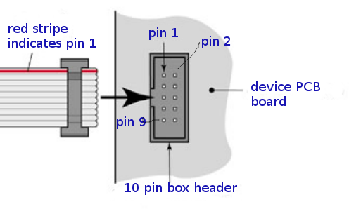

SPI connector A
==================================

SPI interface uses 2x5 FC-10P 2.54mm dual row IDC sockets connectors are. This allows for flat ribbon cable.

Connectors soldered to both microcontroller and device boards are male.
Ends of connecting cable are female. The cable is straight cable, and connects pin 1 to pin 1, pin 2 to pin 2...

   SPI connector and cable orientation - both controller board end and device end use the same pinout.

AAA

.. list-table:: Connector pinout
  :widths: 20 20 60
  :header-rows: 1

  * - pin number
    - pin name
    - description
  * - 1
    - GND
    - Ground.
  * - 2
    - V
    - 3.3V
    - SPI operating voltage, typically 3.3V. Controller board powers the device.
  * - 3
    - 5V
    - Controller board powers the device.
  * - 4
    - NC
    - Not connected, used to avoid connecting wrong cable. Box header pin should be cut, and cable plugged for this pin.
  * - 5
    - SCLK
    - SPI clock from controller (master) to device (slave).
  * - 6
    - MOSI
    - Data from controller to device, master out/slave in.
  * - 7
    - MISO
    - Data from device to controller, master in/slave out.
  * - 8
    - SS
    - Chip select, activates SPI device. This signal is inverted, the device is activated when this is 0V and deactivated when 3.3V.

BB

.. list-table:: Current network configuration as signals
  :widths: 25 75
  :header-rows: 1

  * - signal name
    - description
  * - nc_nr
    - Device number.
  * - nc_net
    - IO device network name.
  * - nc_connect
    - IP address (or host name) and port of a server to connect to. Port is optional. Single '*' indicates that
      light house will be used to find server, but it has not been found yet. String ending with
      '*' means IP address determined to by lighthouse. Ending '^' indicates new user setting.
  * - nc_wifi
    - WiFi network name (SSID).
  * - nc_pass
    - WiFi password, only new set value is shown (pre shared key).
  * - nc_ip
    - Network address, like "192.168.1.220". This can be static IP address set by user,
      IP address by DHCP (indicated with '*') or new set value for IP address (indicated with  '^').
  * - nc_status
    - Zero indicates that all is fine. Other values indicate an error code. Error codes are the same as
      blinked by IO device LED's morse code, etc.

CC

.. list-table:: Current network configuration as signals
  :widths: 25 75
  :header-rows: 1

  * - pin number
    - pin name
  * - x1
    - GND

SS
