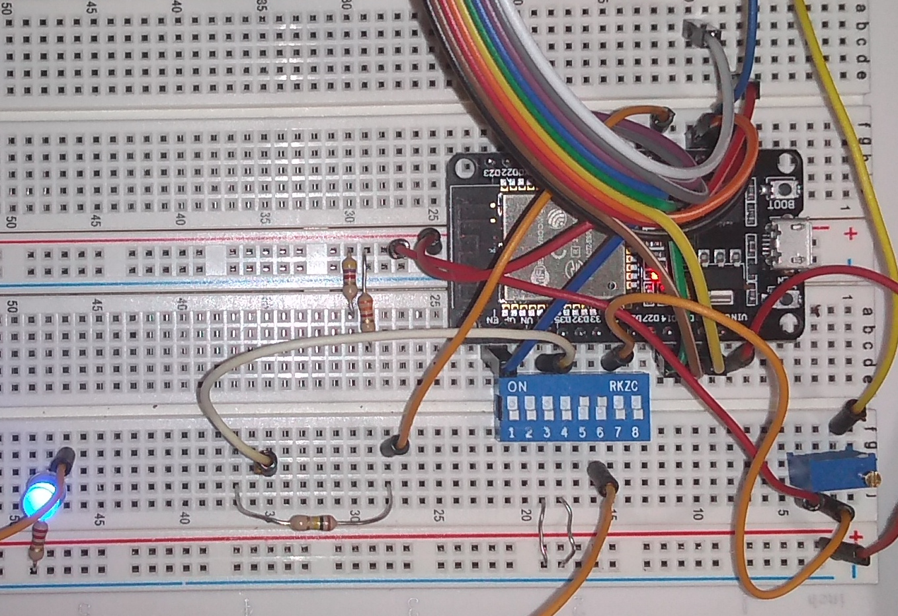

Pins example “jane”
=======================
The “jane” is name for “pins” library example IO device application. “Carol” is name for a specific IO board, here MELIFE ESP32 development board which has specific uses for it’s pin. 

Carol hardware
*******************
It is useful to give name to a IO board so it can be called. My breadboard MELIFE ESP32 test is called “carol”, so the name “carol” means ESP32 with Arduino libraries. This combination can be developed by either Visual Studio Code + Platform IO or Arduino IDE. 

   “Carol” is a bit of a mess, it needs to survive for a day of testing.

Carol hardware wiring is as follows:

THE GPIO PIN ADDRESSESS HERE ARE NOT WELL CHOSEN AND HAVE BEEN CHANGED. THIS TEXT NEEDS TO BE UPDATED.

.. list-table:: Carol IO pins
   :widths: 25 20 15 40
   :header-rows: 1

   * - IO pin name
     - IO pin type
     - GPIO address
     - Description
   * - DIP_SWITCH_3
     - digital input
     - 34
     - Blue 8 dip switch block, switch pin 3 grounds the input. Dip switch is also declared as pull-up, but this doesn't seem to do anything on ESP32.
   * - DIP_SWITCH_4
     - digital input
     - 35
     - Blue 8 dip switch block, switch pin 4 grounds the input.
   * - GAZERBEAM
     - digital input
     - 36
     - Photo transistor signal as interrupt.
   * - TOUCH_SENSOR
     - digital input
     - 4
     - Touch the sensor T0 (GPIO4)
   * - POTENTIOMETER
     - analog input
     - 25
     - 10k potentiometer wired to give voltage from 0 to 3.3V, ADC channel 8
   * - SERVO
     - PWM
     - 22
     - Servo PWM control. PWM channel 0 (set as bank) is used with 50 Hz frequency and 12 bits precision, and initialized at middle (2048)
   * - DIMMER_LED
     - PWM
     - 33
     - LED dimmer PWM control. PWM channel 1 (set as bank) is used with 5000 Hz frequency and 12 bits precision, and initialized at dark (0)

The IO pin name is name what Jane application uses for specific functionality, like potentiometer, DIP switch 3, or PWM controlled dimmed blue led. IO address is hardware specific, that tells what has been wired to which pin of the ESP32.  For Arduino libraries, it is Arduino GPIO pin number.

JSON configuration and generated C code
****************************************
The Jane example was used for this pins library and JSON configuration and generated C code can be found earlier in this document. 

The jane application
****************************************
The jane-example.c is simple single thread example IO device application. It demonstrates how to use IO trough “pins” interface. 

* The pins_setup() initialize the IO pins.
* pin_set() set IO pin state
* pin_get() get IO pin state

.. code-block:: c

    #include "jane.h"

    /* Here we include hardware specific IO code. The file name is always same for jane, but
       pins/<hardware> is added compiler's include paths
     */
    #include "pins_io.c"

    os_timer t;
    os_boolean state;
    os_int dip3, dip4, touch, dimmer, dimmer_dir, potentiometer;

    /**
    ****************************************************************************************************

      @brief Process entry point.

      The osal_main() function is OS independent entry point.

      @param   argc Number of command line arguments.
      @param   argv Array of string pointers, one for each command line argument. UTF8 encoded.

      @return  None.

    ****************************************************************************************************
    */
    osalStatus osal_main(
        os_int argc,
        os_char *argv[])
    {
        pins_setup(&pins_hdr, PINS_DEFAULT);

        os_get_timer(&t);
        state = OS_FALSE;
        dip3 = dip4 = touch = -1;
        dimmer = 0;
        dimmer_dir = 1;
        potentiometer = -4095;

        /* When emulating micro-controller on PC, run loop. Just save context pointer on
           real micro-controller.
         */
        osal_simulated_loop(OS_NULL);
        return 0;
    }

    /**
    ****************************************************************************************************

      @brief Loop function to be called repeatedly.

      The osal_loop() function...

      @param   app_context Void pointer, reserved to pass context structure, etc.
      @return  The function returns OSAL_SUCCESS to continue running. Other return values are
               to be interprened as reboot on micro-controller or quit the program on PC computer.

    ****************************************************************************************************
    */
    osalStatus osal_loop(
        void *app_context)
    {
        os_int x, delta;
        os_char buf[32];

        /* Digital output */
        if (os_has_elapsed(&t, 50))
        {
            os_get_timer(&t);
            state = !state;
            pin_set(&pins.outputs.led_builtin, state);
        }

        /* Digital input */
        x = pin_get(&pins.inputs.dip_switch_3);
        if (x != dip3)
        {
            dip3 = x;
            osal_console_write(dip3 ? "DIP switch 3 turned ON\n" : "DIP switch 3 turned OFF\n");
        }
        x = pin_get(&pins.inputs.dip_switch_4);
        if (x != dip4)
        {
            dip4 = x;
            osal_console_write(dip4 ? "DIP switch 4 turned ON\n" : "DIP switch 4 turned OFF\n");
        }

        /* Touch sensor */
        x = pin_get(&pins.inputs.touch_sensor);
        delta = touch - x;
        if (delta < 0) delta = -delta;
        if (delta > 20)
        {
            touch = x;
            if (touch)
            {
              osal_console_write("TOUCH_SENSOR: ");
              osal_int_to_str(buf, sizeof(buf), touch);
              osal_console_write(buf);
              osal_console_write("\n");
            }
        }

        /* Analog input */
        x = pin_get(&pins.analog_inputs.potentiometer);
        delta = potentiometer - x;
        if (delta < 0) delta = -delta;
        if (delta > 100)
        {
            potentiometer = x;
            osal_console_write("POTENTIOMETER: ");
            osal_int_to_str(buf, sizeof(buf), potentiometer);
            osal_console_write(buf);
            osal_console_write("\n");
        }

        /* PWM */
        dimmer += dimmer_dir;
        if (dimmer > 4095 || dimmer < 0) dimmer_dir = -dimmer_dir;
        pin_set(&pins.pwm.dimmer_led, dimmer);

        return OSAL_SUCCESS;
    }

    /**
    ****************************************************************************************************

      @brief Finished with the application, clean up.

      The osal_main_cleanup() function closes the stream, then closes underlying stream library.
      Notice that the osal_stream_close() function does close does nothing if it is called with NULL
      argument.

      @param   app_context Void pointer, reserved to pass context structure, etc.
      @return  None.

    ****************************************************************************************************
    */
    void osal_main_cleanup(
        void *app_context)
    {
    }

190918, updated 21.5.2020/pekka

