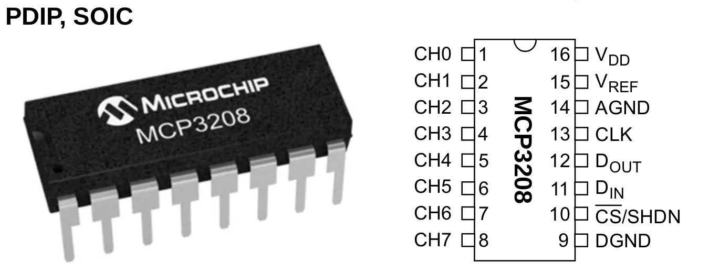
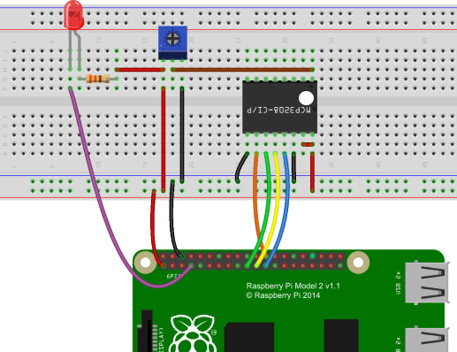

ADC MCP3208 
============

MCP3208 is 8-Channel 12-Bit A/D converters chip created by Microchip Technology Inc, which connects
to micro-controller trough SPI bus. This chip is nice for hobbyist, it is simple to program and is
available as 16-PDIP (pins for trough holes) which is perfect for breadboard or home made PCB
prototyping. There is also 4 channel version of the chip MCP3204, and similar 10 bit ADCs MCP3004 and MCP3008.
(10 bit chips versions require modification in processing of device's SPI reply)

- Device are successive approximation 12-bit analog to digital (A/D) converters with on-board sample and hold circuitry. 
- The MCP3208 is programmable to provide four pseudo-differential input pairs or eight single-ended inputs. 
- Single supply operation: 2.7V - 5.5V
- 100 ksps max. sampling rate at V DD = 5V, 50 ksps max. sampling rate at V DD = 2.7V

   "MCP3208 chip pins. Select PDIP package for drill trough PCB or breadboard.

Raspberry PI wiring and pin configuration
##########################################

   MCP3208 wiring to Raspberry PI

* VDD - 3.3V on Raspberry Pi
* VREF - 3.3V on Raspberry Pi
* AGND - GND on Raspberry Pi
* CLK - "SPI0 SCLK" on Raspberry Pi 2 or 3
* Dout - "SPI0 MISO" on Raspberry Pi, GPIO 11
* Din - "SPI0 MOSI" on Raspberry Pi, GPIO 10
* CS/SHDN - "SPI0 CS0" on Raspberry, Pi GPIO 8
* DGND - GND on Raspberry Pi
* CH0 - Voltage from potentiometer

Add MCP3208 configuration to buster/config/pins/grumpy/pins_io.json. "buster" is name of my IO application and "grumpy" is name of the hardware it runs on.
You can name analog inputs as you like, I have used here simple "sig0", "sig1"... I gave name "adc1" for the first MCP3208. If there are two chips, the second
one could be "adc2" and it would need at least it's own CS pin and SPI device number "addr". 

* "bank": value 0 selects main SPI bus, value 1 selects aux SPI bus. Settings for miso, mosi and sclk must match this SPI bus number.
* "addr": For spi device this sets device number within SPI bus. "cs" setting much match device number.
   For an analog input pin: Specifies MCP3028 input channel.

In example below I have two analog signals connected to pins 3 and 4 of MCP3028 on Raspberry PI's SPI bus. These signals are electronics 
voltage and motor voltage. I make group "analogs" to enable me to read both these signals with one function call in C. (group name can 
be anything, but no special characters, spaces, etc). Then I set up scaling that my scaled values are volts: Range "min" - "max" is
scaled to "smin" - "smax". "min" and "smin" are missing, because values are default zeroes. "smin" and "smax" can be only integer 
values, so I first convert to integer mV, and then set "digs" to divide value by 10^3.
 
::

    {
    "io": [{
        "name": "buster",
        "groups": [
        {
            "name": "analog_inputs",
            "pins": [
            {"name": "electrV", "device": "spi.adc1", "addr": 3, "max": 4095, "smax": 25170, "digs": 3, "group": "analogs"},
            {"name": "motorV", "device": "spi.adc1", "addr": 4, "max": 4095, "smax": 25170, "digs": 3, "group": "analogs"}
            ]
        },
        {
            "name": "spi",
            "pins": [
            {"name": "adc1", "driver":"mcp3208", "bank": 0, "addr":0, "miso": 9, "mosi": 10, "sclk": 11, "cs": 8, "frequency-kHz": 100, "flags": 0}
            ]
        }
        ]
    }]
    }

Export analog inputs as IOCOM signals
######################################

Export the analog input states trough IOCOM, add signals with same names as pins to config/signals/signals.json, etc.
Range "min" - "max" here is only hints for user interface, in case value is displayed as graphic bar.

::

    {
    "name": "buster",
    "mblk": [
    {
        "name": "exp",
        "flags": "up",
        "groups": [
        {
            "name": "state",
            "signals": [
            {"name": "electrV", "type": "float", "min": 0, "max": 10},
            {"name": "motorV", "type": "float", "min": 0, "max": 10}
            ]
        }
        ]
    }
    ]
    }

C build
#########

MCP specific code is in pins_adc_mcp3208.c file. When pins library is compiled, the PINS_MAX_MCP3208_ADC define sets how 
many MCP3208 chips can be connected. Default value depends on operating system, for Raspberry PI this is 2. For PlatformIO
define this in platformio.ini build flags:

::

    build_flags =
        -D PINS_MAX_MCP3208_ADC=1

notes 5.8.2020/pekka
