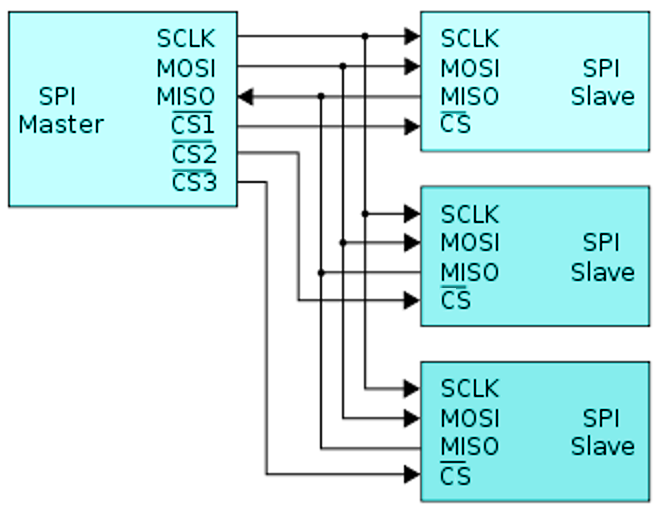

SPI - serial peripheral interface
==================================

   SPI bus wires, each device has own CS pin.

* SCLK: Clock signal
* MOSI: data from master to slave (master out slave in)
* MISO: data from slave to master
* CS1, CS2, CS3: Chip select for SPI devices. Active low.

Raspberry PI SPI pins
######################

The main SPI bus with two slave selects is available on the header of all PIs. The second (aux) SPI with the option
of up to three slave selects) is available on 40-pin versions of PIs. PIGPIO documentation has good information about
using SPI devices in short, easy read, format.

.. list-table:: Raspberry PI SPI related GPIO pins
   :widths: 18 12 12 12 12 12 12 
   :header-rows: 1

   * - SPI bus
     - MISO
     - MOSI
     - SCLK
     - CS0
     - CS1
     - CS2
   * - Main SPI
     - 9
     - 10
     - 11
     - 8
     - 7
     -
   * - Aux SPI
     - 19
     - 20
     - 21
     - 18
     - 17
     - 16

SPI devices
####################

.. toctree::
   :maxdepth: 1
   :caption: Contents:

   adc-mcp3208

