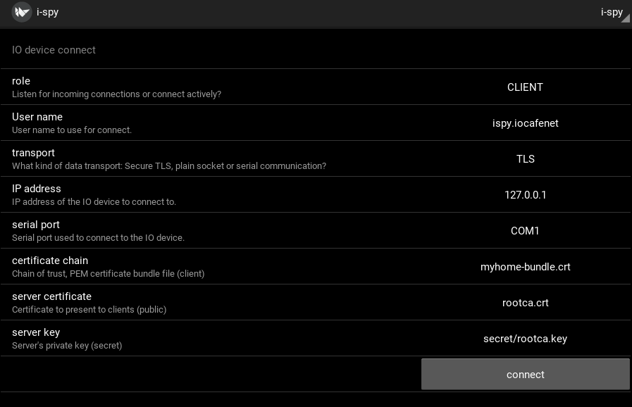
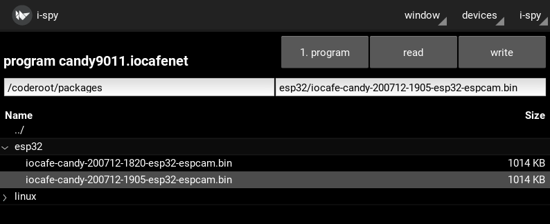

Program updates trough IOCOM using ispy
===========================================

I spy can be used to load software "installation packages" to IO device trough IOCOM connection.
For example I can use ispy to connect to server "frank", and update frank's softwware. Or if 
there is ESP32 camera module "candy" connected to "frank" server, I can update it's software 
as well.

The installation package is native installation package for target system. For ESP32 this is
simlpy the compiled binary file software, for linux this is debian package. Ready installation
packages can be kept in subdirectories under /coderoot/packages directory. See notes about
"Linux installation packages" and "ESP32 installation packages" in this documentation.

The software can be uploaded trough IOCOM only if the target device is already running IOCOM.
First installation to new device must be done by other means: 

* Linux: install the application's .deb package. Debug version cannot install packages, binary doesn't have setuid bit.
* ESP32: install the binary trough USB/serial port.

Connecting to the IO server with ispy
**************************************

This picture visualizes ispy connecting to frank server running in same computer (127.0.0.1)  trough TLS
using example security certificate, etc (not secure, only for testing). "Frank" server is assumed to be
already running. Click connect button, default password is "pass" (also for testing only, not secure). 

   Connecting to server "frank" with "ispy".

Upload the installation package to "candy" ESP32 CAM
*****************************************************

Select "candy" from "devices" menu, and "program" from "window" menu. If candy is on and is
not visible in frank, most common two reasons are candy's wifi has not been set up or that
candy is not authorized in frank's user accounts, see devices/accounts, window/configure.

   Upload program to "candy" ESP32 camera.

Select "iocafe-candy-20..." from esp32 directory and click "write" button to start program upload.

To do/current status
*********************

* ESP32 software support seems fully implemented and seems to be working. 
* Linux installation seems to be work. Daemon to start installed software at boot is not implemented, nor does there
  newly installed software restart automatically. 
* Windows: Not implemented, plan to test with .msi installation packages at some point.
* STM32, Teensy: Not implemented, planned for STM32 version with dual bank feature.

200712, updated 12.7.2020/pekka

