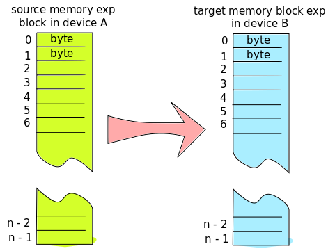

Memory blocks
=============
Communication is based on memory blocks. Device A stores data to be transferred into memory block. 
Communication maintains identical copy of the memory block in device B. Separate memory blocks are 
necessary to implement two directional communication.

A memory block is byte array which is copied from a device to another. Under the hood his is quite 
a bit more complex, since only changes are transferred over communication, there is compression 
and synchronization, but user of this library should not need to care about this. There can be multiple 
recipients of one memory block.  There are IOCOM API functions for allocating, accessing memory block
parameters and content, for data transfer synchronization, and callbacks.

   logically flat memory copy.

A memory block in device A is copied to identical memory block in device B. If the memory blocks 
have different size, the extra data is ignored.

Communication between two devices typically involves several memory blocks: Typical IO board has “exp” 
block for signals exported trough communication, “imp” for imported signals,  “conf_imp” / ”conf_exp” 
memory blocks for configuring the IO device, and static "info" memory block for exporting memory block 
and signal configuration metadata.

180727, updated 20.5.2020/pekka
