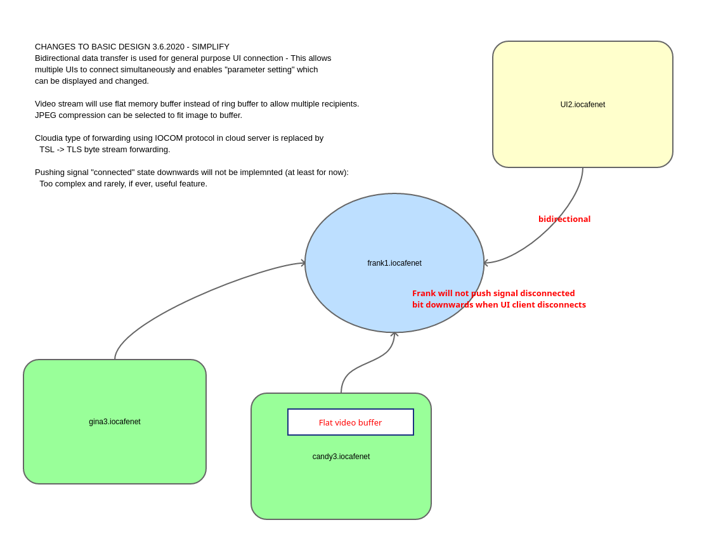

Design changes 3.6.2020
========================

* Bidirectional data transfer will be used for general purpose UI connection. 
  This allows multiple UIs to connect simultaneously and enables "parameter setting" which 
  can be displayed and changed. Application specific UI:s can be coded in device or server.
* Video stream will use flat memory buffer instead of ring buffer to allow multiple recipients. 
  JPEG compression can be selected to fit image to buffer. 
* Cloud: Cloudia type of forwarding using IOCOM protocol in cloud server is replaced by 
  TSL -> TLS byte stream forwarding.
* Pushing signal "connected" state downwards will not be implemnted (at least for now):
  Too complex and rarely, if ever, useful feature. 

   changes in IO device network.

200603, updated 3.6.2020/pekka
