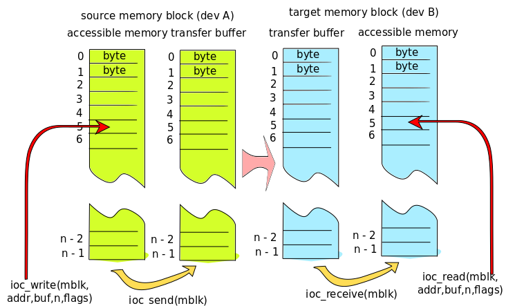

Data synchronization
====================
The synchronization logic preserves time order of changes. Consequent changes are received in
same order as they were set or in same snapshot. Never in reverse order. 

   integrity and order of is preserver in data transfer.

Transfer buffer drawn above here is simplified, implementation detail like real record keeping, buffering and transfer format are not discussed here.

Memory block content is accessed from application code using low level ioc_write() and ioc_read() functions, or signal based ioc_set*() and ioc_get*() functions. Target buffer is read only and source buffer is read/write. On source side, the ioc_send() function copies source memory block to be transferred (or at least modified part of it) thus marking a synchronization frame (snapshot). We can say that ioc_send() records (or may record) a snapshot of user memory for transfer. On target end, the ioc_receive() function copies data from transfer buffer to be accessible in memory buffer. The copied data is last complete transferred snapshot. Notice that individual snapshots may be dropped. Receives sees this a multiple snap shots merged as one.

Even snap short may merged, order of changes is never reversed. If sender makes two changes and calls ioc_send() after each change, receiver can see these two changes as one snapshot, but never as snapshots in wrong order or as partial snap shots. 

190502, updated 20.6.2019/pekka
