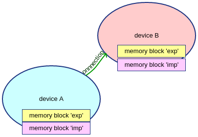
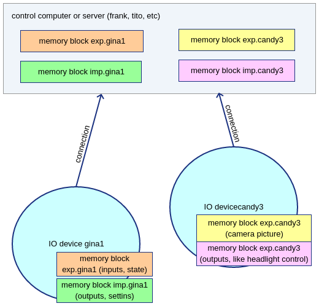

Devices, memory blocks and connections
======================================

A device holds multiple memory blocks, at minimum one for receiving data and another for sending data. There can be also memory blocks for IO device structure information (metadata), for programming flash, etc. Basic communication doesn’t really care what memory block is for.

Connecting two devices together
*******************************
A simple example is connecting device A and device B. Both devices “know” that they have memory blocks named "exp" and "imp", and these memory blocks are constructed by ioc_initialize_memory_block() calls at both ends. Once connection is established, the memory blocks which have same name will be transferring data.

   two connected devices.

Connecting multiple IO devices to control computer
**************************************************
Usually we need to add some more complexity. For example we have one control computer, which controls two IO devices: One for temperature and other for lights.

   multiple IO devices connected to one controller.

Here the memory blocks are also created before establising the connections between the control PC and the IO devices. Difference is that here we use also device name. To transfer data between two memory blocks, both memory block name and device name must match. There can also be multiple IO device networks, thus matching network name is also needed.

Device name and number
**********************
Device name and device number make an device identifier which is unique within a control system. Device name describes IO board functionality, so two devices with name “gina”, etc are assumed identical. The device name must be a short string with only upper case characters ‘A’ - ‘Z’. Since one control system may have multiple same kind of IO devices, these are separated by device number. Usually 1 if first device… The device name is typically hard coded in device software and device number (if needed) either set by jumpers or stored in persistent memory. The devices can be also automatically enumerated, for example user interface modules or game clients do not need a specific device number.

Who connects and who listens for connections?
*********************************************
It doesn’t really matter to operation which end listens for socket connection, or if connection is trough serial port. But it matters a great deal with TLS and when traffic is passed trough firewalls.
Generally good choice is that assume that IO board “knows” IP address of the control computer or finds it by lighthouse UDP multicast and connects to it with TCP socket. If DCHP is used to get IO device’s network configuration and lighthouse to find server to connect to, this works like plug and play.
If connecting to cloud server, or to any server outside local network segment, then IP address to connect to must be configured to IO device.

190502, updated 21.5.2020/pekka
