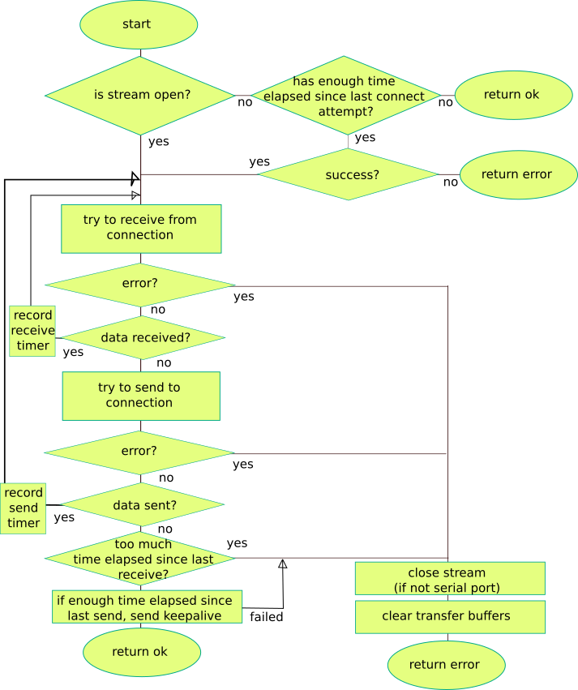

Run - keep the connection alive
================================
The ioc_connection_run() function keeps the connection the connection alive. This is single thread
function which must be called repeatedly. Similar, but more efficient, implementation exists for
multi threaded environments mode using select() instead of polling for new data. 

   connection flow chart

This function calls ioc_connection_send() and ioc_connection() receive functions to send/receive data. 

190502, updated 20.5.2020/pekka
