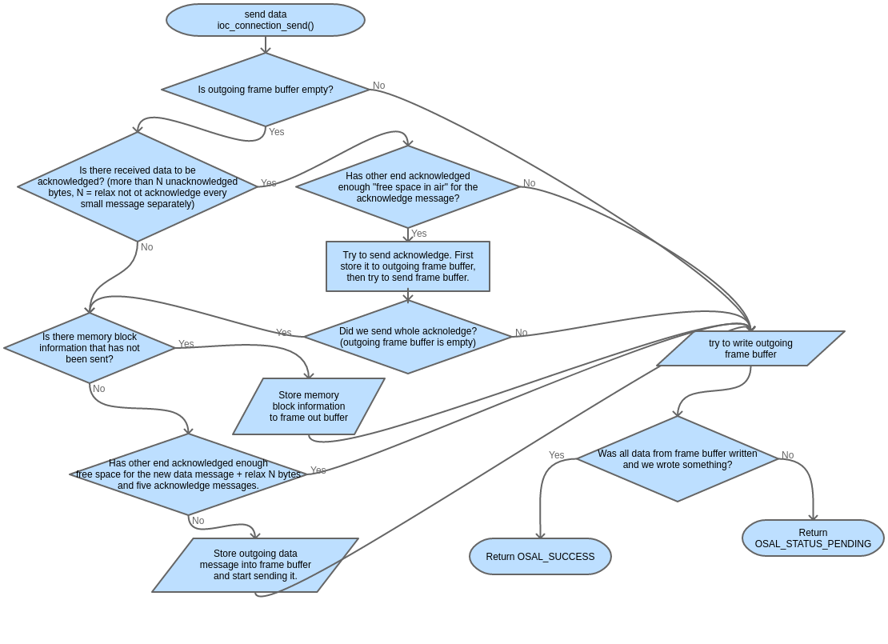

Sending data
===============
The ioc_connection_send() function flow chart: The function takes care about flow control, sending memory block information and memory block data. Memory block data is moved from source synchronization buffer to frame out buffer, this step includes division of data into frames, compression, etc.

   send flow chart

190502, updated 22.5.2020/pekka

