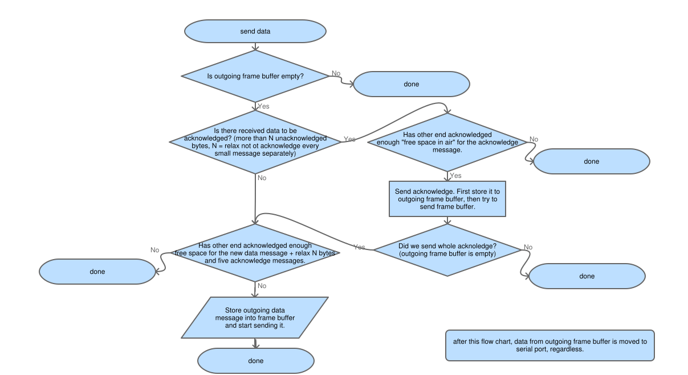

Flow control
==========================
The flow control is used to stop transmitting before serial communication buffers overflow 
or socket communication buffers collect so much data that communication starts to lag.

Basic idea is simple. A end of connection calculates number of bytes it has sent. The other end
calculates number of bytes it has received and sends this number back as an acknowledgement message (= keep 
alive message, the two are the same). So sender can know how many bytes it has sent out, but may not have yet
been been processed by the other end: Subtract last received RBYTES from number of bytes sent out. 

This is done using 16 bit unsigned integers. Since we subtract these from each others, we simply ignore overflow.
This works as long as maximum allowed lag is below 65536 bytes. We call the maximum lag parameter MAX_IN_AIR.

Serial receive buffer (256 bytes, 255 effective) is able to hold at least two data frames of 
IOC_SERIAL_FRAME_SZ (96) bytes, plus we allow IOC_SERIAL_UNACKNOGLEDGED_LIMIT (40) bytes for unacknowledged data, 
and reserve some space of the buffer to be used only for acknowledgements. Since our minimum acknowledgement 
is 40 bytes, we acknowledge minimum 200 bytes with five acknowledgement messages, which is more than enough 
to keep communication up at any load conditions. 

   flow control

Buffers for socket communication are typically large compared to serial communication, and bigger MAX_IN_AIR 
values can be used. Since sockets do never lose data and can, especially over Internet, do have significant 
latency: large values would be beneficial. On the other hand embedded systems may have limited socket buffers. 
Thus conservative MAX_IN_AIR value 2000 bytes is for now used for sockets, but may be changed in further testing.  

Preventing possibility of dead lock: Common problem with acknowledge based flow control is that if both ends
simultaneously have sent out the maximum number of bytes “in air”, but not yet received reply that these have 
been processed, so both ends halt sending at same time.  This has been resolved by reserving space for 5 
acknowledgement messages and setting minimum acknowledgement size as 40 bytes.

200310, updated 22.5.2020/pekka
