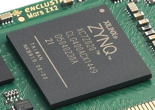
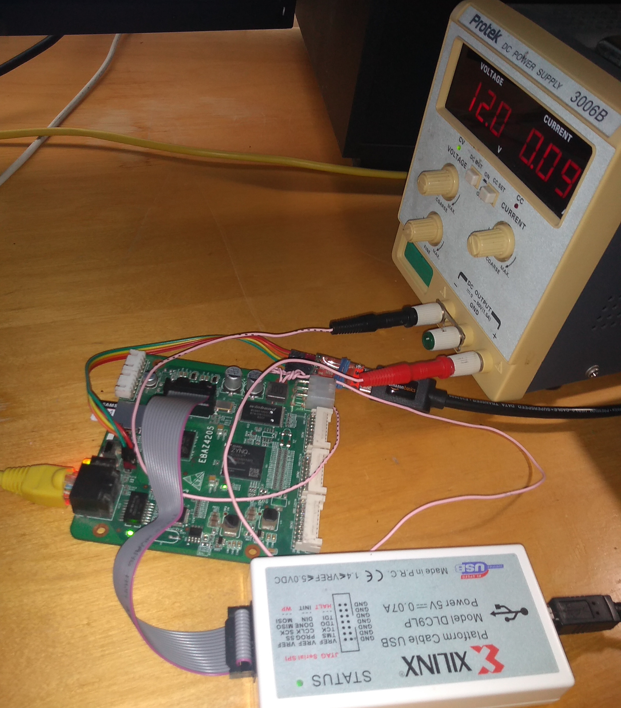
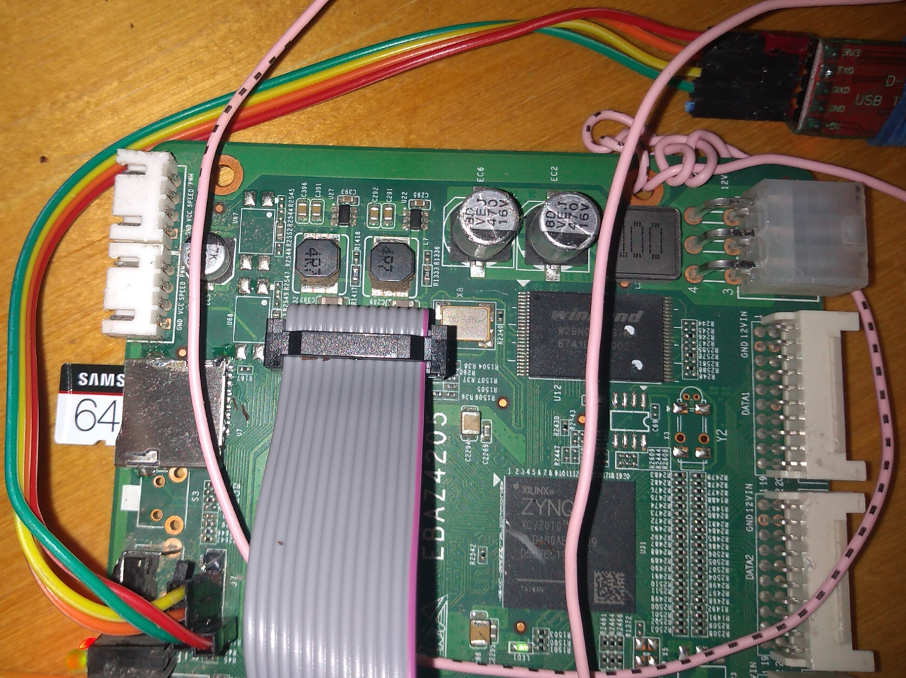
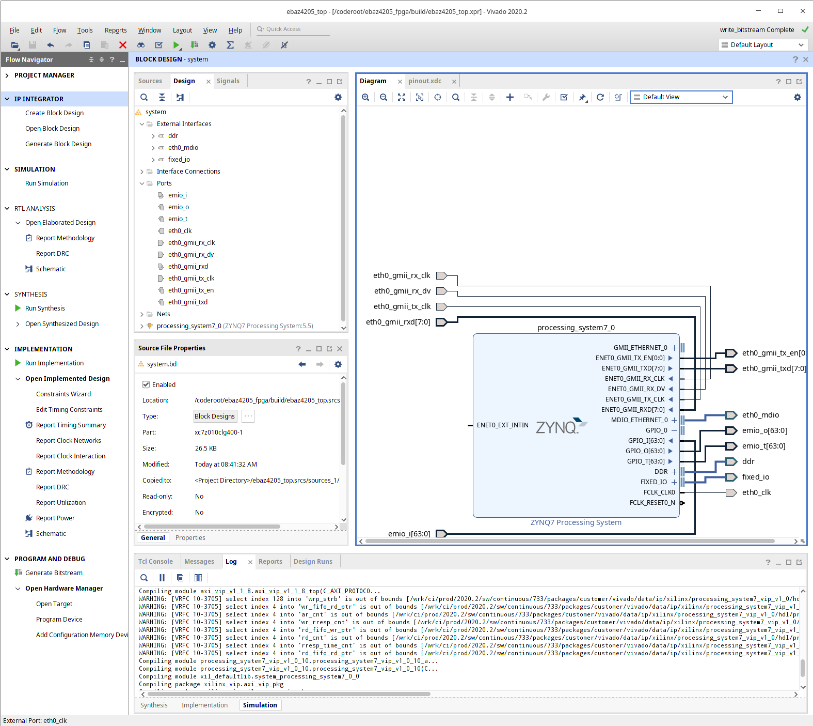
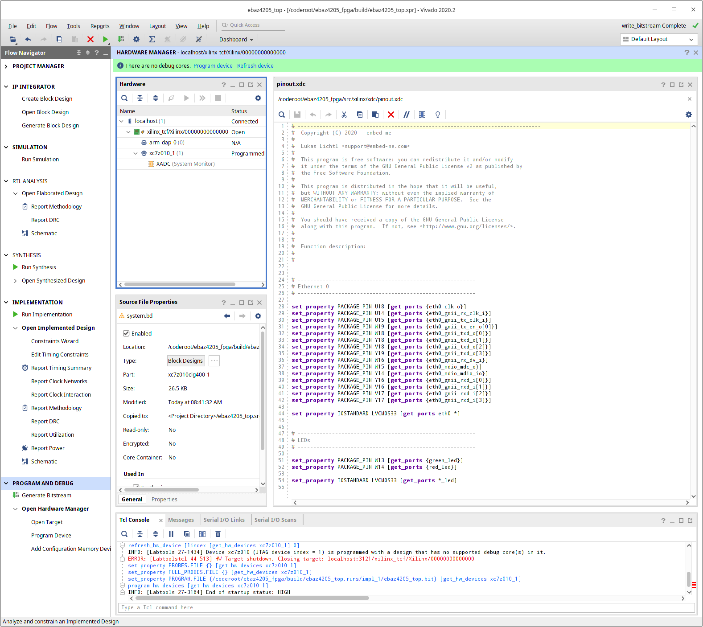

EBAZ4205 - Zynq 7020 - notes
==================================

Zynq 7020 Soc: Two ARM9 cores + powerful FPGA. It is not cheap and easy, start with a lot of time and patience, be prepared to for challenges. In practise ARM9 runs linux, altough it is possible to run FreeRTOS, etc. PetaLinux is version of Yocto linux used by Xilinx. FPGA boots from ARM.

   Zynq 7070 chip.

EBAZ4205: Used crypto miner board. Low cost ~$10 to get Zync development board.

   My test setup.

EBAZ4205 board
******************************************

There is very good article series about getting started with EBAZ4205 by embed-me.com. This is not detailed instructions, but rather give good overview how to get started. You can get find article series by googling:

:: 

    EBAZ4205 - "Recycle" a cheap crypto-miner (Part 1) - embed-me

The EBAZ4205 board do come with varying flavors:

* Some have 7010 and some 7020 chip.
* Some have ethernet crystal installed, some don't and the clock is provided by Zynq.
* Some may be already converted for dev board use (get one if you find it).

Hardware modifications are necessary to convert the crypto miner to dev board. See https://github.com/xjtuecho/EBAZ4205 for pictures and schematics. 

* Solder SD, JTAG and UART connectors to board. These often come with board, but in a bag.
* Move boot select resistor (20k) on board to another location. It is size of sand grain, which makes it hard. I cannot even see the resistor without classess. USB microscope is must.

Prepare Linux SD
******************

* Try first using buildroot ISO image known to work (embed-me.com article). 
* You might move on to Petalinux or set up your own Yocto linux.

Connect UART, connect with putty, power up and boot linux
*************************************************

FTDI USB to "TTL" level serial converter.

UART is 115200, no parity, one stop bit, no handshake. Three wires: Rx, Tx, ground.

Power 12V, ~100 mA avergae.

Installing Vivado
*******************

Install Vivado (WebPACK version 2020.2 to /coderoot/Xilinx), google "xilinix unified installer download". You 

Tricks to make embed-me's ebaz4205_fpga example work with Vivado 2020.2:
I changed "set scripts_vivado_version 2020.1" to "set scripts_vivado_version 2020.2" in system.tcl. This is not good way, but works in this particular case.

Vivado cable drivers need to be installed manually on linux (Xilinx in /coderoot/Xilinx)

* cd /coderoot/Xilinx/Vivado/2020.2/data/xicom/cable_drivers/lin64/install_script/install_drivers/
* sudo ./install_drivers 
* unplug and plug USB cable to Xilinx box.

Programming FPGA directly
**************************

JTAG programmer: I use Xilinx DLC9LP, but many others should work. There are 14 bin female JTAG connectors in both Xilinx box and on EBAZ4205. Pin 1 is marked with white triangle on EBAZ4205's silk screen, and with red wire in ribbon cable.

   JTAG ribbon cable and USB to UART.

   Test code of embed-me running.

   Programming FPGA

