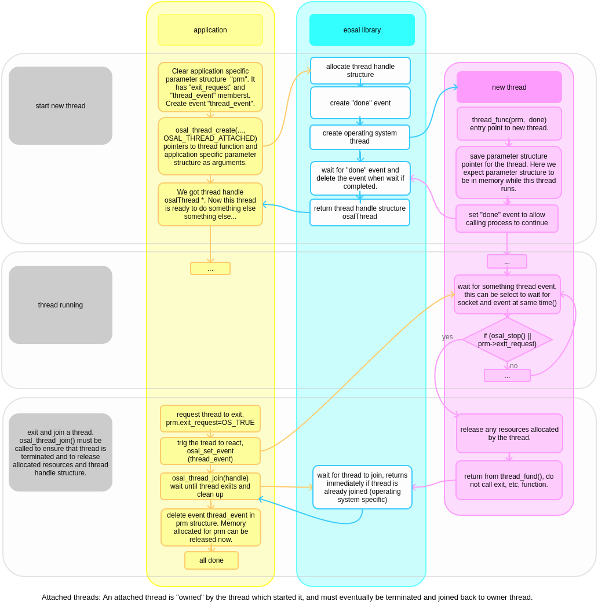

threads
==================================

The eosal thread API is wrapper for operating system threads. It exist to provide unified interface to thread specific functionality.

create and terminate attached thread
********************************************

Attached threads are bound to parent thread which start then, and must exit and be joined to parent thread before it can exit.

   creating, run and terminate attached thread flow chart

Code example

.. literalinclude:: code/osal_attached_thread_example.c
   :language: c

create and terminate detached thread
*******************************************

Detached threads run completely independently from thread that started them, and do continue executing after parent thread has been exited. 

thread priority
******************

Linux specific note: Linux thread scheduler does amazingly good job without application specific thread priority settings, so these are not supported for nor.
While it is possible to use real time scheduling and set priorities and we may add support for this in esoal, I have found this often counterproductive. 
It requires serious knowledge and effort to get better performance than what linux scheduler provides easily.

