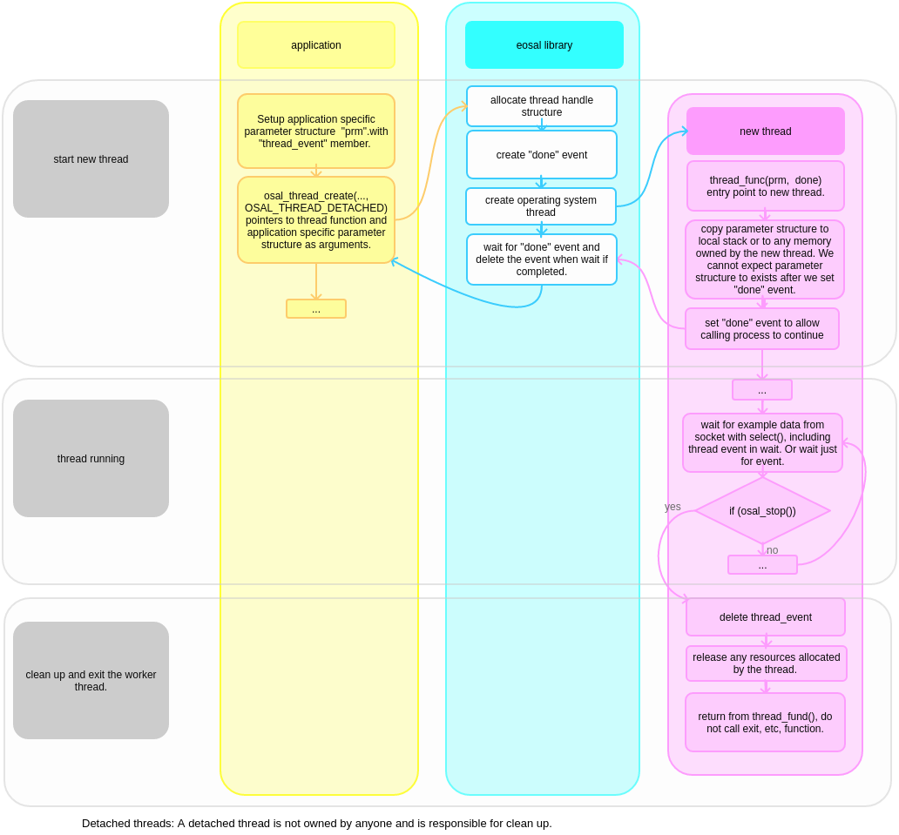

threads
==================================

The eosal thread API is wrapper for operating system threads. It provides unified interface to thread functionality.

create and terminate attached thread
********************************************

Attached threads are bound to parent thread which start then, and must exit and be joined to parent thread before it can exit.

.. figure:: pics/210403-attached-thread.png

- :doc:`210404-attached-thread-code-example`

create and terminate detached thread
*******************************************

Detached threads run completely independently from thread that started them, and do continue executing after parent thread has exited. 
The parent thread is not responsible for any clean up tasks.

- :doc:`210404-detached-thread-code-example`

terminating threads when process exits
****************************************

Terminating individual threads is not part of this API, but on application's responsibility. Typically reauest_exist, thread_event, etc.
are passed in application's parameter structure to the new thread. 

Process exit is triggered by osal_request_exit() function. 
The thread events which may be waited for and prevent the process from existing need to be flagged as osal_event_create(OSAL_EVENT_SET_AT_EXIT),
which adds those event to list of events to set when the osal_request_exit() is called.

thread priority
******************

Linux specific note: Linux thread scheduler does amazingly good job without application specific thread priority settings, so these are not supported for nor.
While it is possible to use real time scheduling and set priorities and we may add support for this in esoal, I have found this often counterproductive. 
It requires serious knowledge and effort to get better performance than what linux scheduler provides easily.

sleep functions
******************

* os_timeslice() Sleep for very short time, like one scheduler time slice. Real sleep period is operating system/HW, but in order of 1 ms.

* os_sleep(time_ms) Sleep for specific period, milliseconds.  

* os_microsleep(time_us) Sleep for specific period, microseconds.  

Notice: The sleep function precision varies by operating system, and may be longer if high priority threads eat the processor time. 
