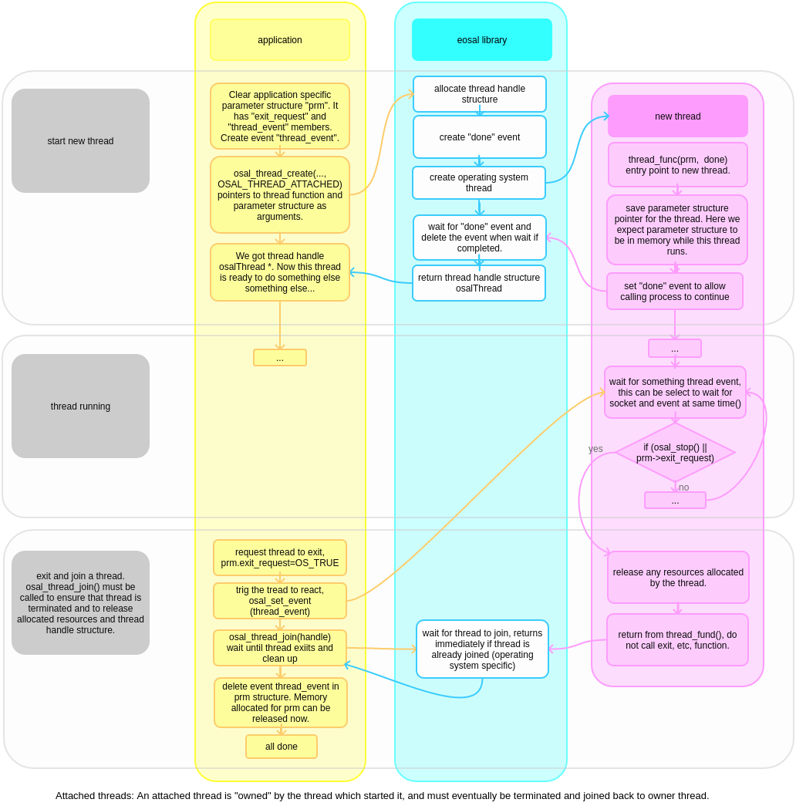

Threads
==================================

The eosal thread API is wrapper for operating system threads. It provides unified interface to OS thread functions.

A process can run multiple tasks concurrently, and these concurrently running tasks are called threads of execution. 
The treads of the same process and share memory and other processe's resources. Typically access to shared resources 
must be synchronized, see mutexes. On a single core processor, the processor switches between different threads. 
This context switching generally happens frequently enough that the user perceives the threads as running at 
the same time. On a multiprocessor or multi-core system, multiple threads or tasks will generally run at 
the same time, workload is split between processor cores.

- :doc:`210405-osal-thread-header`

Prerequisites and build without multithread support
*****************************************************

The osal thread API is just wrapper to underlying operating system threads. Thus operating system threads are needed.

Build time define OSAL_MULTITHREAD_SUPPORT, either 0 or 1 selects if osal thread functions are used. If zero, 
osal_thread_create, osal_thread_join, osal_thread_set_priority, and os_timeslice() are defined
as empty macros and produce no code. Sleep functions, os_sleep and os_microsleep, are always available.

Create and terminate attached thread
********************************************

Attached threads are bound to parent thread which start then, and must exit and be joined to parent thread before it can exit.

- :doc:`210404-attached-thread-code-example`

Create and terminate detached thread
*******************************************

Detached threads run completely independently from thread that started them, and do continue executing after parent thread has exited. 
The parent thread is not responsible for any clean up tasks.

.. figure:: pics/210403-detached-thread.png

- :doc:`210404-detached-thread-code-example`

Create and join thread functions 
*******************************************

Use osal_thread_create() to create attached or detached thread, and osal_thread_join to join an attached
thread back to parent. 

::

   osalThread *osal_thread_create(
      osal_thread_func *func,
      void *prm,
      osalThreadOptParams *opt,
      os_int flags);

   void osal_thread_join(
      osalThread *handle);

Thread entry point function type:  When a new thread is created by osal_thread_create() function, pointer to user defined
thread entry point function is given as argument. The user defined entry point function must be a function with no return 
value, and taking two arguments. Void pointer to parameters (prm), which is typically pointer to user defined parameter
structure for the new thread. Second  argument is done event, which the new thread must set by calling osal_event_set() 
function once the new thread has processed parameters and as far as needed.

::

   typedef void osal_thread_func(
      void *prm,
      osalEvent done);

Flags for creating thread: Either OSAL_THREAD_ATTACHED or OSAL_THREAD_DETACHED given to osal_thread_create
sets if the newly created thread is to be attached to a thread handle.
If flag OSAL_THREAD_ATTACHED is given, the new thread is attached and must eventually be joined back to it 
by osal_thread_join() function. In this case the osal_thread_create() returns thread handle which is used as 
argument to join. If OSAL_THREAD_DETACHED is given, newly created thread is detached from thread which
created it, the osal_thread_create() returns OS_NULL.

::

   #define OSAL_THREAD_ATTACHED 1
   #define OSAL_THREAD_DETACHED 2

Optional thread parameters: This parameter structure can be given when creating a new thread. 
It contains opetional and some platform dependent settings for a new thread. Allocate this 
structure from stack, ose oe_memclear to fill it with zeros and set only parameters you want 
to modify from defaults.

::

   typedef struct osalThreadOptParams
   {
      /** Name for the new thread. Some operating systems allow naming threads, which is very
         useful for debugging. If no name is needed this can be NULL.
      */
      const os_char *thread_name;

      /** Stack size for the new thread in bytes. Value 0 creates thread with default stack
         size for operating system.
      */
      os_memsz stack_size;

      /** Priority for the new thread, for example OSAL_THREAD_PRIORITY_NORMAL. If zero, default
         is used.
      */
      osalThreadPriority priority;

      /** Pin thread to specific processor core.
      */
      os_boolean pin_to_core;

      /** Core number to pin to if pin_to_core is set.
      */
      os_short pin_to_core_nr;
   }
   osalThreadOptParams;

Terminating threads when process exits
****************************************

Terminating individual threads is not part of this API, but on application's responsibility. Typically request_exist, thread_event, etc.
are passed in application's parameter structure to the new thread. 

Process exit is triggered by osal_request_exit() function. 
The thread events which may be waited for and prevent the process from existing need to be flagged as osal_event_create(OSAL_EVENT_SET_AT_EXIT),
which adds those event to list of events to set when the osal_request_exit() is called.

Thread priority
******************

The osal_thread_set_priority() function sets current thread priority. Thread priority will set how operating system scheduler should share
time between threads. Most systems we work on implement preemptive multitasking. This mean that threads running on higher priority get 
processor time first, and only when no higher priority thread needs time then the lower priority threads will receive it. 
Multiprocessor or multi-core environment will change this, since one processor or core can be executing only one task.

:: 

    osalStatus osal_thread_set_priority(
        osalThreadPriority priority);

The OSAL_THREAD_PRIORITY_LOW, OSAL_THREAD_PRIORITY_NORMAL and OSAL_THREAD_PRIORITY_HIGH are used to prioritize execution of normal 
threads. The OSAL_THREAD_PRIORITY_TIME_CRITICAL is reserved for real time tasks only, and using this priority will put special 
requirements on the thread.

Linux specific note: Linux thread scheduler does amazingly good job without application specific thread priority settings, so these are not supported for now.
Calling osal_thread_set_priority() does nothing. While it is possible to use real time scheduling and set priorities and we may add support for this in eosal, 
I have found this often counterproductive: It requires serious effort and knowledge to get better performance than the default linux scheduler provides easily.

Poll loop delay
******************

The os_timeslice is short sleep, somewhere around 1 ms. It is used in "poll" loops to avoid eating up all processor time. If building
without multithreading support (OSAL_MULTITHREAD_SUPPORT is 0), the os_timeslice is defined as empty macro and does nothing.

::

    void os_timeslice(void);

Sleep functions
******************

The os_timeslice() function sleep for very short time, like one time slice. Real sleep period is operating system/HW dependent, in order of 1 ms.
To sleep for a specific period, use either os_sleep(milliseconds) or  os_microsleep(microseconds).  
The sleep function precision varies by operating system, and may be longer if high priority threads eat the processor time. 

:: 

    void os_sleep(
        os_long time_ms);

    void os_microsleep(
        os_long time_us);
