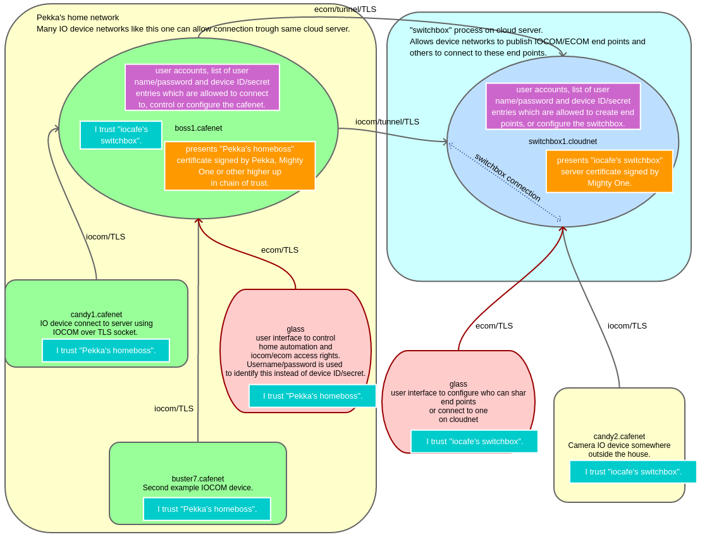

IOCOM secure network topology - take 2
========================================
The network topology of distributed system is closely related to security: 

* Only TLS connections.
* Client (IO device, user interface, etc) identifies a service by server certiticate. 
* Client's trust on a service can be explicitely configured: For example user interface may have multiple roots of trusts. Or trust can be establised automatically when an IO device connects to a service the very first time. 
* Service identifies clients by device ID and secret (like "candy1.cafenet", or by user name and password.
* We need to keep IO device networks of separate people strictly apart. Even we would use the same cloud server 
  to access data from two IO device networks, data can newer be passed from one IO device network to another. 
* Password or secrets are never stored outside the device itself as clear text, but as cryprographic hash. Altough these are transferred over secure connection once the other end has been identified.

   A switchbox process can be used to forward connections trough cloud server.

210221, updated 22.2.2021/pekka
