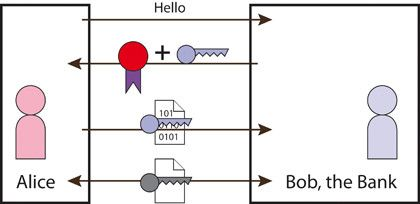

Security
================================

I believe that good security is as simple as possible, so that requirements which are necessary to maintain it are understandable. The IOCOM security doesn't answer device security as whole, only to communication security. 

   A simple way to see the security.

.. toctree::
   :maxdepth: 2
   :caption: Contents:

   process-identification/210227-process-and-user-identification
   210228-certificates-and-chain-of-trust
   authentication/200114-device-identification-at-connect
   authentication/200127-pairing-io-device-and-control-computer
   authentication/191024-security-vunerabilities
   network-topology/190919-iocom-network-topology
   network-topology/210221-network-topology-connection-forwarding.rst

updated 21.2.2021/pekka
